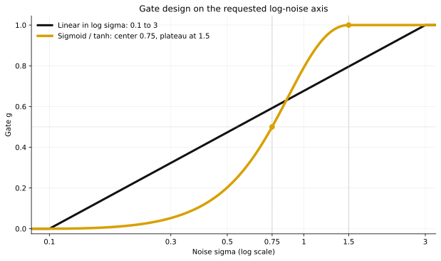
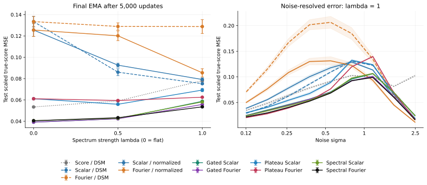
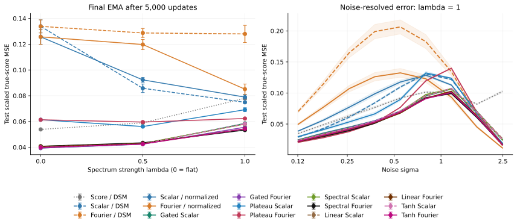
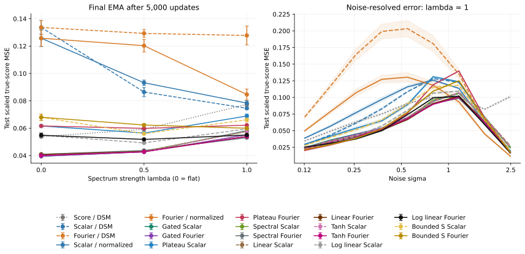

# Fourier Score

**Fixed Gaussian reference scores with frequency-normalized neural residuals.**

Inspired by the asymptotic Gaussianity of Fourier transforms, this project
constructs a fixed Gaussian reference from the training-data mean and
frequency-dependent power spectrum. The analytic reference score captures these
statistics, while a neural residual models the remaining structure
and dependencies. The residual output scale follows from the second moment of
the Gaussian-subtracted denoising target.

By default, the experiments preserve the backbone and DSM objective. They study
whether frequency-dependent covariance helps relative to a channelwise scalar covariance,
in both **pixel-space NCSN++** and **frozen-autoencoder latent diffusion**.

[Quick start](#quick-start) · [Method](#method) · [Experiments](#reproduce-the-experiments) ·
[GMM notebook](#understand-the-mechanism) · [Loss comparison](#gmm-loss-comparison) ·
[Gated comparison](#gmm-gated-comparison) · [Plateau experiment](#gmm-plateau-comparison) ·
[Spectral gate](#gmm-spectral-gate-comparison) · [Linear / tanh](#gmm-linear-and-tanh-gates) ·
[Log-axis gates](#gmm-log-axis-gates) · [Figures](#figures) ·
[Reports](reports/README.md) · [Development](#development)


*Score parameterizations under a shared DSM objective. (a) Direct scaled-score
prediction. (b) A fixed Gaussian reference plus a spectrally scaled neural
residual, using the same backbone architecture. (c) The analytic adapter and its
residual scale, determined by fixed training-data moments.
[Figure source](scripts/plot_method.py) · [PNG](assets/loss_comparison.png) ·
[PDF](assets/loss_comparison.pdf)*

## Research status

| Experiment | Question or observation | Status |
|---|---|---|
| MNIST | The two Gaussian parameterizations gave similar FID in the exploratory run. | Preliminary single-run observation. |
| CIFAR-10 | Does frequency-dependent covariance help relative to scalar covariance? | Three paired seeds × two Gaussian arms, 950K updates; results pending. |
| LSUN Churches | Is the construction also useful in the latent space of a fixed autoencoder? | Three paired seeds × two Gaussian arms, target 500K updates; results pending. |
| Matched-moment Gaussian / GMM | Can the residual learn structure beyond an exactly known Gaussian reference? | Reproducible synthetic mechanism experiment with an analytic true score. |
| GMM loss comparison | At spectral heterogeneity $\lambda=1$, normalized residual loss reduced Fourier true-score error by 33.4% relative to Fourier DSM; Scalar DSM remained best. | 45 runs, three paired seeds, 5,000 updates; [results and protocol](#gmm-loss-comparison). |
| GMM gated comparison | At $\lambda=1$, Gated Fourier reduced error by 25.8% versus Scalar DSM, with a high-noise tradeoff. | 99 runs, validation-selected gate, independent test banks; [results](#gmm-gated-comparison). |
| GMM plateau gate | Forcing $g=1$ above $\sigma=1$ increased Fourier error by 12.6% overall and 25.8% at high noise versus the sigmoid gate. | Fixed transition $[0.8,1.0]$, 18 new runs, three paired seeds; [results](#gmm-plateau-comparison). |
| GMM spectral gate | At $\lambda=1$, a frequencywise gate reduced error by 4.0% versus the sigmoid gate; flat and intermediate spectra regressed slightly. | One backbone, one normalized MSE, 18 new runs; [results](#gmm-spectral-gate-comparison). |
| GMM linear / tanh gates | At $\lambda=1$, both improve the sigmoid by about 2.3%; Linear has the lowest middle-noise mean, while Spectral retains the lowest overall mean. | Fixed center and local slope, 36 new runs, three paired seeds; [results](#gmm-linear-and-tanh-gates). |
| GMM log-axis gates | At $\lambda=1$, log-linear nearly ties the sigmoid overall; the bounded S gate lowers low-noise error by 13.5% but raises total error by 8.6%. Both regress at $\lambda=0,0.5$. | Prior plotted shapes fixed before training, 36 new runs, 135 audited controls; [results](#gmm-log-axis-gates). |

The scalar–Fourier comparison measures the combined effect of frequency-dependent
covariance in the reference score and residual scale. Pretrained models and
published FID values serve as external reference points.

## Quick start

Run from the repository root. Python 3.11 and the committed `uv.lock` specify the
environment. Optional dependencies are separate from the core pixel experiment.

```bash
uv sync --locked --python 3.11
uv run --locked python scripts/doctor.py --device cpu

# Train, sample and evaluate a small synthetic example.
uv run --locked python train.py -c configs/smoke.json --device cpu \
  --set name=readme_smoke
uv run --locked python sample.py -r saved/readme_smoke/last.pt \
  -o saved/readme_smoke_samples
uv run --locked python evaluate.py dsm -r saved/readme_smoke/last.pt \
  -o saved/readme_smoke_dsm.json
```

This example runs three optimizer updates. Use a new run name and output path
when repeating it.
For CUDA, run `scripts/doctor.py --device cuda` in the same environment before
training. On a supported Mac, use `--device mps`. Optional extras include
`ldm`, `datasets`, `metrics`, `notebooks`, `figures`, and `tensorboard`.

## Method

For $y=x+\sigma_t\epsilon$, $\epsilon\sim\mathcal N(0,I)$, all pixel arms default to
`loss.objective=dsm` and minimize

$$
\mathcal L_{\mathrm{DSM}}=
\mathbb E_{x,t,\epsilon}\left\|\sigma_t s_\theta(y,t)+\epsilon\right\|^2.
$$

The baseline predicts the scaled score directly, $\sigma_t s_\theta=h_\theta$.
The Gaussian parameterizations use

$$
\sigma_t s_\theta(y,t)=\sigma_t s_G(y,t)
+\mathcal F^{-1}\!\left[b_t\mathcal F h_\theta(y,t)\right],
$$

$$
\widehat{s}_{G,k}=-\frac{\widehat y_k-\widehat\mu_k}{P_k+\sigma_t^2},
\qquad b_{t,k}=\sqrt{\frac{P_k}{P_k+\sigma_t^2}}.
$$

$\mu$ is the full mean image and $P_k$ the per-channel power of its centered,
orthonormal Fourier transform, estimated from **training data only**. The
reference has coefficient one and a fixed diagonal covariance in the Fourier
basis. The neural network observes the entire image and learns dependencies
across channels and frequencies.

For $T=-\epsilon-\sigma_t s_G$, matching population moments give
$\mathbb E|\widehat T_k|^2=b_{t,k}^2$ for Gaussian and non-Gaussian data. The scale
therefore normalizes the residual target's second moment. Estimated statistics
and numerical power floors make this a plug-in approximation in real experiments.
The original DSM objective retains the $b_{t,k}^2$ weighting in normalized
residual coordinates.

| Parameterization | Gaussian reference | Residual scale |
|---|---|---|
| `score` | None | 1 |
| `scalar_gaussian` | Same full mean; frequency-averaged variance within each channel | Channelwise |
| `fourier_gaussian` | Same full mean; per-channel, per-frequency variance | Frequencywise |

`diffusion` is an additional epsilon-prediction sign convention. In the latent
path, $y=\alpha_t z+\sigma_t\epsilon$ replaces $\mu$ by $\alpha_t\mu$ and $P_k$
by $\alpha_t^2P_k$; the common adapter returns total epsilon. The first stage
stays frozen. The [method implementation](fourier_score/model/reference.py) and
[GMM notebook](notebooks/gmm_fourier_residual.ipynb) give the corresponding
reference and residual calculations.

### Normalized residual loss (VE)

Set `loss.objective=normalized_residual` with `scalar_gaussian` or
`fourier_gaussian` to regress the raw backbone output directly against

$$
\tau_k=\frac{\sigma_t\mathcal F(x-\mu)_k-P_k\mathcal F\epsilon_k}
{\sqrt{P_k(P_k+\sigma_t^2)}},\qquad
\mathcal L_{\mathrm{norm}}=\mathbb E\|h_\theta-\mathcal F^{-1}\tau\|^2.
$$

The scalar control uses the same formula with the channelwise average power.
The target is computed directly from clean data to avoid cancellation at large
noise levels. Both objectives use the configured `mean` or `half_sum` reduction.
The score adapter and sampler still apply the same residual scale $b_k$.
This objective currently supports pixel-space VE only.

```bash
uv run --locked python scripts/run_comparison.py -c configs/mnist.json \
  --parameterizations scalar_gaussian fourier_gaussian --seeds 0 \
  --set loss.objective=normalized_residual \
  --set trainer.iterations=30000 --dry-run
```

Use `loss.objective=dsm` for the paired DSM controls. Normalized runs append
`_normalized_residual` to the resolved run name, and record the objective in
training logs and checkpoint configs. Changing objectives is rejected on resume;
older configs without this field mean `dsm`. Compare common validation DSM,
noise/frequency diagnostics and matched-sampler FID, rather than comparing the
training loss values across objectives. `grad_norm_before_clip` is also logged.

### Noise-gated Gaussian residuals (VE)

An optional fixed gate $g(\sigma)\in[0,1]$ connects direct score prediction at
low noise ($g=0$, Score/DSM) to the Gaussian residual parameterization at high
noise ($g=1$):

$$
\sigma s_\theta=g\sigma s_G+\mathcal F^{-1}[c\mathcal Fh_\theta],
\qquad
c_{\sigma,k}^2=(1-g)^2+g(2-g)\frac{P_k}{P_k+\sigma^2}.
$$

With `loss.objective=normalized_residual`, the raw backbone output regresses the
matching normalized target, so every gate trains **one backbone with one MSE**,
without a teacher or added parameters. The gate is part of the model adapter:
training and sampling share it, run names and resume signatures record its
settings, and active gates require a VE Gaussian parameterization. Select it
with `fourier.gate.mode`:

| Mode | Gate $g$ | Settings | GMM study |
|---|---|---|---|
| `none` (default) | $g=1$, the original residual path | — | [Loss comparison](#gmm-loss-comparison) |
| `constant` | Fixed value; 0 and 1 give endpoint controls | `value` | — |
| `log_sigma` | Sigmoid in $\log\sigma$ | `sigma_switch`, `sharpness` | [Gated comparison](#gmm-gated-comparison) |
| `log_sigma_plateau` | Sigmoid reaching exactly one at `sigma_hi` | `log_sigma` settings, `sigma_lo`, `sigma_hi` | [Plateau](#gmm-plateau-comparison) |
| `spectral_cap` | Frequencywise $g_k$ with a bounded residual scale | plateau settings, `delta` | [Spectral gate](#gmm-spectral-gate-comparison) |
| `linear_sigma`, `tanh_sigma` | Clipped ramp or tanh in linear $\sigma$ | `sigma_switch`, `sharpness` | [Linear / tanh](#gmm-linear-and-tanh-gates) |
| `linear_log_sigma` | Straight line in $\log\sigma$ | `sigma_lo`, `sigma_hi` | [Log-axis gates](#gmm-log-axis-gates) |
| `bounded_log_sigmoid` | S curve with exact zero and one plateaus | `sigma_lo`, `sigma_hi`, `sigma_switch`, `sharpness` | [Log-axis gates](#gmm-log-axis-gates) |

```bash
uv run --locked python train.py -c configs/smoke.json \
  --set loss.objective=normalized_residual \
  --set fourier.gate.mode=log_sigma \
  --set fourier.gate.sigma_switch=1.0 \
  --set fourier.gate.sharpness=4.0 --dry-run
```

Every mode except `constant` is compared in the GMM studies below, and the
[MNIST runner](#mnist-remaining-normalized-and-gated-comparisons) trains the same
arms with the fixed GMM settings. The [gate report](reports/method/gates.md)
gives each mode's equations, numerically stable implementation, `--dry-run`
command and checkpoint-signature rules.

### Log-axis gate design

`linear_log_sigma` is straight on a logarithmic noise axis, rising from $g=0$ at
$\sigma=0.1$ to $g=1$ at $\sigma=3$. `bounded_log_sigmoid` is exactly zero at
$\sigma\leq0.1$, one-half at $\sigma=0.75$ and exactly one at $\sigma\geq1.5$,
joining both plateaus with zero slope; sigmoid and tanh are equivalent
expressions for this one S curve. The
[log-axis design notes](reports/method/gates.md#log-axis-gate-design) give the
formulas, exported curve data and the options of the GMM comparison runners.



## Reproduce the experiments

### MNIST: remaining normalized and gated comparisons

The MNIST runner covers the same 19 arms as the GMM comparison: Score / DSM,
Scalar / DSM, Fourier / DSM, plus Scalar/Fourier versions of normalized,
sigmoid, plateau, spectral cap, sigma-linear, sigma-tanh, log-linear and
bounded S. It defaults to seed 0, 100,000 updates and sequential GPU jobs.
New models use the fixed GMM gate settings with the MNIST preset's noise
range and preprocessing; these settings have not been selected on MNIST.

```bash
# Inspect completion checks and the training queue without starting jobs.
uv run --locked --extra metrics python scripts/run_mnist_remaining.py \
  --device cuda --download --with-fid --dry-run

# Train missing models, evaluate validation DSM, and sample 10,000 images for FID.
uv run --locked --extra metrics python scripts/run_mnist_remaining.py \
  --device cuda --download --with-fid
```

The runner searches `saved/` and `saved/recovered/` for compatible completed
checkpoints, including the recovered Scalar / DSM control. A matching run name
or training log alone is insufficient: the checkpoint must have the requested
step, architecture, data split, seed, objective, gate, optimizer and training
settings. Historical completed controls can be reused and their training
source hashes are recorded. New training is written under
`saved/mnist_remaining_100k/`, preserving earlier incomplete run directories.
Repeating the command reuses completed models and resumes compatible `last.pt`
checkpoints in the new study. Resume retains the trainer's source/environment
checks. Keep the source and environment fixed during an interrupted study: a
study started before the template refactor continues from a worktree at its
[epoch-0 tag](reports/provenance.md#resume-or-re-evaluate-an-epoch-0-run).

All selected models are evaluated using the current code and EMA weights on
the same 5,000 validation images: evaluation seed 17001, batch 128, 20 noise
bins and four frequency bands. With `--with-fid`, the runner first exports the
real validation images automatically, then generates 10,000 images per model
with the preset's PC sampler (1,000 steps, batch 64, seed 17002). Completed
samples are reused only when checkpoint hash, source, settings and image
count match. Other sample directories are preserved under a timestamped name.
Training loss values across DSM and normalized objectives are not the common
comparison metric; use validation DSM and FID. This is held-out validation,
not the official MNIST test set or an exact-score evaluation.

Results accumulate in `saved/mnist_remaining_100k/summary.csv` and
`summary.json`, with detailed metrics and images in its `evaluation/` folder.
Omit `--with-fid` for training and DSM only; add it later to reuse trained
models and generate images. Use `--seeds 0 1 2` for three paired seeds,
`--only <arm names>` for a subset, or a new `--output` for another study.
`--dry-run` lists all arm names. Training several models on one GPU proceeds
sequentially; the runner does not start parallel GPU jobs.

### CIFAR-10: scalar versus Fourier covariance

```bash
# Prepare full-training-set statistics shared by both arms.
uv run --locked python scripts/prepare.py -c configs/cifar10_950k.json --download

# Inspect six commands: two arms × three paired seeds, 950K updates each.
bash scripts/reproduce_cifar10.sh 950k --device cuda --seeds 42 43 44 \
  --parameterizations scalar_gaussian fourier_gaussian \
  --set trainer.microbatch_size=32 --dry-run

# Remove --dry-run to launch those six jobs sequentially.
# Resume one interrupted run in the matching source checkout:
uv run --locked python train.py \
  -r saved/cifar10_950k_full_fourier_gaussian_s42/last.pt
```

The command selects the two Gaussian arms. Add `score` to include the direct
score baseline. Independent devices can run separate jobs. Training
uses single-device FP32 with microbatch accumulation. Keep the source revision,
locked environment, effective batch and microbatch identical across paired arms.
Replace `950k` with `50k` for the 45K/5K train/holdout pilot or `1m3` for
1.3M updates on the full training set. Keep their different FID reference splits
separate. Inspect config overrides with `train.py -c <config> --dry-run`.

### LSUN Churches: frozen first stage

```bash
uv sync --locked --extra ldm --extra datasets --extra metrics
uv run --locked --extra datasets python scripts/download_ldm.py \
  --model lsun_churches --with-data
uv run --locked --extra ldm python ldm.py prepare \
  -c configs/ldm/lsun_churches_l2.json --device cuda
uv run --locked --extra ldm python ldm.py compare \
  -c configs/ldm/lsun_churches_l2.json --device cuda --seeds 41 42 43 \
  --parameterizations scalar_gaussian fourier_gaussian --dry-run
```

Remove `--dry-run` to train after preparation. The target budget is 500K updates.
The `_l2` preset applies **L2/DSM** to both arms. The original CompVis Churches
preset uses **L1**.
If a run stops early, report its actual update count and compare matched budgets.
Weights are stored under `pretrained/ldm/`, with latent caches under
`data/ldm_cache/`. Preserve the frozen first-stage weights for decoding.
`python ldm.py --help` lists preparation, training, sampling, evaluation and FID
commands; each subcommand has its own `--help`.

### Sampling and FID

```bash
uv run --locked python sample.py \
  -r saved/cifar10_950k_full_fourier_gaussian_s42/last.pt \
  -o saved/cifar10_fg_s42_samples50k --device cuda \
  --num-samples 50000 --batch-size 64
uv run --locked python scripts/export_real.py -c configs/cifar10_950k.json \
  --split train -o saved/cifar10_real
uv run --locked --extra metrics python evaluate.py fid \
  --real saved/cifar10_real/png --generated saved/cifar10_fg_s42_samples50k/png \
  --device cuda -o saved/cifar10_fg_s42_fid.json
```

Inference uses EMA. Keep real split, preprocessing, sample count, sampler,
actual NFE, seed, batch size and metric backend fixed. The local
`torch-fidelity` protocol differs from Score-SDE's original TensorFlow metrics.
Report variation across independent training seeds, and curves against both
updates and training time. To inspect available pretrained references, run
`python scripts/download_score_sde.py --list` or
`python scripts/download_ldm.py --list`. Score-SDE weights are converted with
`scripts/import_score_sde.py`; its `--help` describes inference-only import.

To re-evaluate existing CIFAR samples with the original TF-Hub/TF-GAN backend,
use [`scripts/evaluate_score_sde.py`](scripts/evaluate_score_sde.py) in a separate
TensorFlow environment. See [setup and protocol](scripts/README-score-sde-eval.md).
This reads exactly 50,000 saved images and the official CIFAR reference statistics;
it does not generate new samples.

## Understand the mechanism


*Forward and reverse dynamics using the exact Gaussian-mixture score. [PNG](assets/stochastic_process.png) · [PDF](assets/stochastic_process.pdf).*

The [GMM notebook](notebooks/gmm_fourier_residual.ipynb) compares a Gaussian and
a non-Gaussian mixture with identical **population** mean and covariance on an
8 × 8 spatial grid. Their reference scores match, but the mixture's exact score
contains a residual. It measures true-score error and varies spectral
heterogeneity at fixed average power, including the flat-spectrum control.
See [notebooks/README.md](notebooks/README.md) to run it and for its presets
and outputs. The studies below reuse its population, MLP and exact-score
evaluation to compare the objectives and gates of the [method](#method); each
has a full report in [reports/](reports/README.md).
[Generate the figures](#figures).

### GMM loss comparison

At spectral heterogeneity $\lambda=1$, normalized residual loss reduced Fourier
true-score error by 33.4% relative to Fourier DSM, but Fourier remained 14.0%
above Scalar DSM, which stayed best. The study has 45 runs: three paired seeds
and 5,000 updates per run. [Results and protocol](reports/gmm/loss-comparison.md).


## GMM gated comparison

At $\lambda=1$, Gated Fourier reduced error by 25.8% versus Scalar DSM, the best
existing baseline, with a high-noise tradeoff: at $\sigma\geq1$ its error is
20.0% above the ungated Fourier normalized model. The 99 runs use a
validation-selected switch and independent test banks.
[Results and protocol](reports/gmm/gated-comparison.md).


## GMM plateau comparison

Forcing $g=1$ above $\sigma=1$ increased Fourier error by 12.6% overall and
25.8% at high noise versus the sigmoid gate at $\lambda=1$. The transition
$[0.8,1.0]$ was fixed before training; the study adds 18 runs with three paired
seeds. [Results and protocol](reports/gmm/plateau-comparison.md).


## GMM spectral gate comparison

At $\lambda=1$, a frequencywise gate reduced error by 4.0% versus the sigmoid
gate; flat and intermediate spectra regressed slightly. It keeps one backbone
and one normalized MSE and adds 18 runs.
[Results and protocol](reports/gmm/spectral-gate.md).



## GMM linear and tanh gates

At $\lambda=1$, the sigma-linear and sigma-tanh gates both improve the sigmoid by
about 2.3%; Linear has the lowest middle-noise mean, while Spectral retains the
lowest overall mean. Center and local slope match the sigmoid; the study adds 36
runs with three paired seeds. [Results and protocol](reports/gmm/linear-tanh-gates.md).



## GMM log-axis gates

At $\lambda=1$, log-linear nearly ties the sigmoid overall; the bounded S gate
lowers low-noise error by 13.5% but raises total error by 8.6%. Both regress at
$\lambda=0,0.5$. The [log-axis shapes](#log-axis-gate-design) were fixed before
training; the study adds 36 runs and audits 135 existing controls.
[Results and protocol](reports/gmm/log-axis-gates.md).



## Figures

```bash
uv run --locked --extra figures python scripts/plot_method.py
uv run --locked --extra figures python scripts/plot_diagnostics.py
```

Both scripts generate analytic examples on CPU and write PNG, SVG and PDF to
`assets/`.
Use `--output saved/figures` for a separate export. The diagnostic script also
writes synthetic source arrays and numerical checks; its default seed is
20260922 with 32,768 observations per distribution for the moment diagnostic.

| Figure | Interpretation | Export |
|---|---|---|
| Method | Shared DSM objective and Gaussian residual parameterization | [PNG](assets/loss_comparison.png) · [PDF](assets/loss_comparison.pdf) |
| Stochastic process | Exact evolving mixture density with numerical SDE/ODE paths | [PNG](assets/stochastic_process.png) · [PDF](assets/stochastic_process.pdf) |
| Gaussian / GMM residual | Same population moments, different exact scores | [PNG](assets/gaussian_residual.png) · [PDF](assets/gaussian_residual.pdf) |
| Frequency scaling | Analytic residual-target moments checked by Monte Carlo | [PNG](assets/frequency_scaling.png) · [PDF](assets/frequency_scaling.pdf) |
| GMM loss comparison | Trained DSM and normalized residual objectives against the analytic joint score | [PNG](assets/gmm_loss_comparison/gmm_loss_comparison.png) · [PDF](assets/gmm_loss_comparison/gmm_loss_comparison.pdf) |

The one-dimensional process figure uses $\sigma_t^2=4t$ and starts the reverse SDE
from the exact finite-time noisy mixture; the dashed ODE curves are deterministic
trajectories viewed in both directions. The frequency figure uses an 8 × 8 grid
with matched population covariance. Its error bars are two Monte Carlo standard
errors. The frequency curves describe second moments of the noisy residual
regression target.

The [synthetic arrays](assets/diagnostics_data.npz) can be read with
`numpy.load(path, allow_pickle=False)` and reused for custom figure layouts.

## Repository layout

```text
train.py / sample.py / evaluate.py   Pixel training, inference and metrics
ldm.py                             Native latent pipeline
configs/                           Versioned experimental protocols
fourier_score/                     Numerical package covered by source_sha256
  provenance.py                    Repository root, source hash and file digests (stdlib only)
  parse_config.py                  Config inheritance, overrides, type checks, CLI flags, from_args
  config.py                        Pixel config schema, validation and run names
  gates.py                         Objective names and the noise-gate table
  utils.py                         Device, RNG and checkpoint/JSON I/O helpers
  images.py                        PNG writing and preview grids
  evaluation.py                    Checkpoint DSM evaluation and FID/IS of image folders
  logger.py                        metrics.jsonl, TensorBoard and console progress
  gmm.py                           Matched-moment GMM, toy score models and oracle metrics
  model/                           Shared diffusion numerics; pixel adapter, sampler, DSM metrics
  data_loader/                     Datasets, splits, resumable batch streams and statistics
  trainer/                         Pixel trainer, checkpoint format and resume signature, EMA
  backbones/                       Attributed NCSN++, vendored (template model/backbones role)
  ldm/                             Frozen-first-stage latent implementation
experiments/                       Orchestration of multi-run studies
  gmm/                             GMM study registry, pipeline and report export
notebooks/                         Runnable mechanism experiments
scripts/                           Preparation, diagnostics, figures and study launchers
tests/                             Numerical and end-to-end regression checks
  contracts/, golden/              Behavior contracts and frozen epoch-0 references
reports/                           Experiment reports, gate equations and provenance
assets/                            Public figures, synthetic arrays and result tables
```

`model/`, `data_loader/`, `trainer/`, `logger.py`, `parse_config.py` and
`utils.py` fill the slots of [pytorch-template](https://github.com/victoresque/pytorch-template);
its `base/` classes are intentionally absent, as the pixel and latent trainers
share no loop yet.

`fourier_score/` holds the numerics. Its Python files define the
`source_sha256` recorded in checkpoints and GMM runs, and it never imports
`experiments/`, `scripts/` or `tests/`. `experiments/` orchestrates multi-run studies:
`python -m experiments list` shows the registered studies and
`python -m experiments gmm <name>` runs one. The `scripts/run_gmm_*.py`
launchers quoted in the reports remain as thin wrappers around it.
[Reports](reports/README.md) hold the full write-ups, and
[provenance](reports/provenance.md) maps source hashes to Git tags and explains
how to resume runs recorded under an earlier source.

Each run saves its configuration, metrics, training checkpoints and EMA
snapshots under `saved/`. Generated images are stored with their sampling
settings. `docs/` holds local research notes and is excluded from Git.

```bash
uv run --locked --all-extras python -m pytest -q
uv run --locked --extra notebooks python scripts/check_notebooks.py
```

The CI workflow checks numerical behavior and notebook execution on CPU. See
the [development notes below](#development) for source navigation and debugging.

## Development

Start with `fourier_score/model/reference.py` for the Gaussian adapter,
`data_loader/statistics.py` for training-only moments, and `model/model.py` /
`model/loss.py` for the pixel objectives. Pixel training is in
`trainer/trainer.py`, the noise process in `model/process.py` and samplers in
`model/sampling.py`; native latent equivalents live under `fourier_score/ldm/`.

```bash
uv sync --locked --all-extras
uv run --no-sync python scripts/doctor.py --device cpu
uv run --no-sync python scripts/check_notebooks.py --execute
```

Use `--dry-run` to inspect configs and `--help` for each command's options.
Reduce microbatch size to fit device memory while keeping the effective batch
fixed. Resume a run with `train.py -r <checkpoint>` in its original environment.
Give each experiment a distinct run name.

## References and attribution

- Song et al., [Score-Based Generative Modeling through Stochastic Differential Equations](https://arxiv.org/abs/2011.13456), ICLR 2021. [Official code](https://github.com/yang-song/score_sde_pytorch).
- Rombach et al., [High-Resolution Image Synthesis with Latent Diffusion Models](https://arxiv.org/abs/2112.10752), CVPR 2022. [Official code](https://github.com/CompVis/latent-diffusion).
- Karras et al., [Elucidating the Design Space of Diffusion-Based Generative Models](https://arxiv.org/abs/2206.00364), NeurIPS 2022. [Official code](https://github.com/NVlabs/edm).
- [PyTorch Template](https://github.com/victoresque/pytorch-template) inspired the config-driven entry points, checkpointing and separation of concerns. Each domain has its own trainer.

See [LICENSE](LICENSE) and [NOTICE](NOTICE) for source attribution.
Downloaded third-party weights and datasets retain their respective terms.
