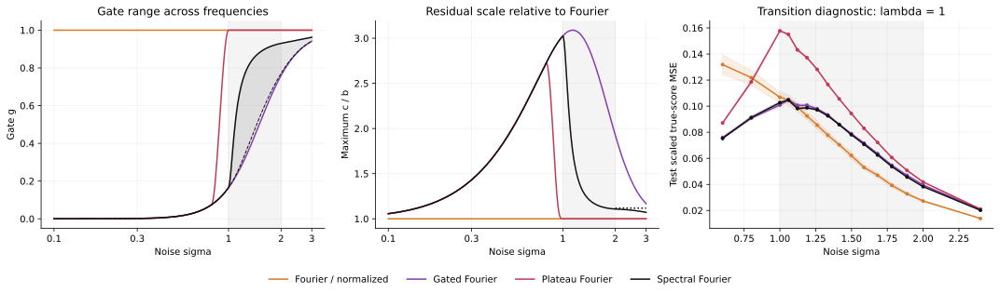
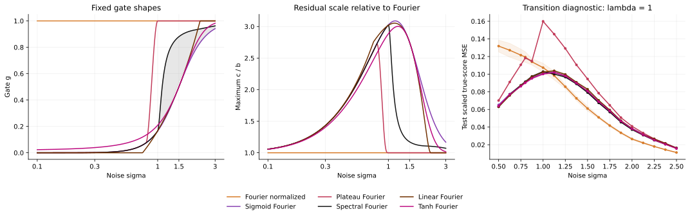

# Fourier Score

**Fixed Gaussian reference scores with frequency-normalized neural residuals.**

Inspired by the asymptotic Gaussianity of Fourier transforms, this project
constructs a fixed Gaussian reference from the training-data mean and
frequency-dependent power spectrum. The analytic reference score captures these
statistics, while a neural residual models the remaining structure
and dependencies. The residual output scale follows from the second moment of
the Gaussian-subtracted denoising target.

By default, the experiments preserve the backbone and DSM objective. They study
whether frequency-dependent covariance helps relative to a channelwise scalar covariance,
in both **pixel-space NCSN++** and **frozen-autoencoder latent diffusion**.

[Quick start](#quick-start) · [Method](#method) · [Experiments](#reproduce-the-experiments) ·
[GMM notebook](#understand-the-mechanism) · [Loss comparison](#gmm-loss-comparison) ·
[Gated comparison](#gmm-gated-comparison) · [Plateau experiment](#gmm-plateau-comparison) ·
[Spectral gate](#gmm-spectral-gate-comparison) · [Linear / tanh](#gmm-linear-and-tanh-gates) ·
[Log-axis gates](#gmm-log-axis-gates) · [Figures](#figures) ·
[Development](#development)


*Score parameterizations under a shared DSM objective. (a) Direct scaled-score
prediction. (b) A fixed Gaussian reference plus a spectrally scaled neural
residual, using the same backbone architecture. (c) The analytic adapter and its
residual scale, determined by fixed training-data moments.
[Figure source](scripts/plot_method.py) · [PNG](assets/loss_comparison.png) ·
[PDF](assets/loss_comparison.pdf)*

## Research status

| Experiment | Question or observation | Status |
|---|---|---|
| MNIST | The two Gaussian parameterizations gave similar FID in the exploratory run. | Preliminary single-run observation. |
| CIFAR-10 | Does frequency-dependent covariance help relative to scalar covariance? | Three paired seeds × two Gaussian arms, 950K updates; results pending. |
| LSUN Churches | Is the construction also useful in the latent space of a fixed autoencoder? | Three paired seeds × two Gaussian arms, target 500K updates; results pending. |
| Matched-moment Gaussian / GMM | Can the residual learn structure beyond an exactly known Gaussian reference? | Reproducible synthetic mechanism experiment with an analytic true score. |
| GMM loss comparison | At spectral heterogeneity $\lambda=1$, normalized residual loss reduced Fourier true-score error by 33.4% relative to Fourier DSM; Scalar DSM remained best. | 45 runs, three paired seeds, 5,000 updates; [results and protocol](#gmm-loss-comparison). |
| GMM gated comparison | At $\lambda=1$, Gated Fourier reduced error by 25.8% versus Scalar DSM, with a high-noise tradeoff. | 99 runs, validation-selected gate, independent test banks; [results](#gmm-gated-comparison). |
| GMM plateau gate | Forcing $g=1$ above $\sigma=1$ increased Fourier error by 12.6% overall and 25.8% at high noise versus the sigmoid gate. | Fixed transition $[0.8,1.0]$, 18 new runs, three paired seeds; [results](#gmm-plateau-comparison). |
| GMM spectral gate | At $\lambda=1$, a frequencywise gate reduced error by 4.0% versus the sigmoid gate; flat and intermediate spectra regressed slightly. | One backbone, one normalized MSE, 18 new runs; [results](#gmm-spectral-gate-comparison). |
| GMM linear / tanh gates | At $\lambda=1$, both improve the sigmoid by about 2.3%; Linear has the lowest middle-noise mean, while Spectral retains the lowest overall mean. | Fixed center and local slope, 36 new runs, three paired seeds; [results](#gmm-linear-and-tanh-gates). |
| GMM log-axis gates | At $\lambda=1$, log-linear nearly ties the sigmoid overall; the bounded S gate lowers low-noise error by 13.5% but raises total error by 8.6%. Both regress at $\lambda=0,0.5$. | Prior plotted shapes fixed before training, 36 new runs, 135 audited controls; [results](#gmm-log-axis-gates). |

The scalar–Fourier comparison measures the combined effect of frequency-dependent
covariance in the reference score and residual scale. Pretrained models and
published FID values serve as external reference points.

## Quick start

Run from the repository root. Python 3.11 and the committed `uv.lock` specify the
environment. Optional dependencies are separate from the core pixel experiment.

```bash
uv sync --locked --python 3.11
uv run --locked python scripts/doctor.py --device cpu

# Train, sample and evaluate a small synthetic example.
uv run --locked python train.py -c configs/smoke.json --device cpu \
  --set name=readme_smoke
uv run --locked python sample.py -r saved/readme_smoke/last.pt \
  -o saved/readme_smoke_samples
uv run --locked python evaluate.py dsm -r saved/readme_smoke/last.pt \
  -o saved/readme_smoke_dsm.json
```

This example runs three optimizer updates. Use a new run name and output path
when repeating it.
For CUDA, run `scripts/doctor.py --device cuda` in the same environment before
training. On a supported Mac, use `--device mps`. Optional extras include
`ldm`, `datasets`, `metrics`, `notebooks`, `figures`, and `tensorboard`.

## Method

For $y=x+\sigma_t\epsilon$, $\epsilon\sim\mathcal N(0,I)$, all pixel arms default to
`loss.objective=dsm` and minimize

$$
\mathcal L_{\mathrm{DSM}}=
\mathbb E_{x,t,\epsilon}\left\|\sigma_t s_\theta(y,t)+\epsilon\right\|^2.
$$

The baseline predicts the scaled score directly, $\sigma_t s_\theta=h_\theta$.
The Gaussian parameterizations use

$$
\sigma_t s_\theta(y,t)=\sigma_t s_G(y,t)
+\mathcal F^{-1}\!\left[b_t\mathcal F h_\theta(y,t)\right],
$$

$$
\widehat{s}_{G,k}=-\frac{\widehat y_k-\widehat\mu_k}{P_k+\sigma_t^2},
\qquad b_{t,k}=\sqrt{\frac{P_k}{P_k+\sigma_t^2}}.
$$

$\mu$ is the full mean image and $P_k$ the per-channel power of its centered,
orthonormal Fourier transform, estimated from **training data only**. The
reference has coefficient one and a fixed diagonal covariance in the Fourier
basis. The neural network observes the entire image and learns dependencies
across channels and frequencies.

For $T=-\epsilon-\sigma_t s_G$, matching population moments give
$\mathbb E|\widehat T_k|^2=b_{t,k}^2$ for Gaussian and non-Gaussian data. The scale
therefore normalizes the residual target's second moment. Estimated statistics
and numerical power floors make this a plug-in approximation in real experiments.
The original DSM objective retains the $b_{t,k}^2$ weighting in normalized
residual coordinates.

| Parameterization | Gaussian reference | Residual scale |
|---|---|---|
| `score` | None | 1 |
| `scalar_gaussian` | Same full mean; frequency-averaged variance within each channel | Channelwise |
| `fourier_gaussian` | Same full mean; per-channel, per-frequency variance | Frequencywise |

`diffusion` is an additional epsilon-prediction sign convention. In the latent
path, $y=\alpha_t z+\sigma_t\epsilon$ replaces $\mu$ by $\alpha_t\mu$ and $P_k$
by $\alpha_t^2P_k$; the common adapter returns total epsilon. The first stage
stays frozen. The [method implementation](fourier_score/method.py) and
[GMM notebook](notebooks/gmm_fourier_residual.ipynb) give the corresponding
reference and residual calculations.

### Normalized residual loss (VE)

Set `loss.objective=normalized_residual` with `scalar_gaussian` or
`fourier_gaussian` to regress the raw backbone output directly against

$$
\tau_k=\frac{\sigma_t\mathcal F(x-\mu)_k-P_k\mathcal F\epsilon_k}
{\sqrt{P_k(P_k+\sigma_t^2)}},\qquad
\mathcal L_{\mathrm{norm}}=\mathbb E\|h_\theta-\mathcal F^{-1}\tau\|^2.
$$

The scalar control uses the same formula with the channelwise average power.
The target is computed directly from clean data to avoid cancellation at large
noise levels. Both objectives use the configured `mean` or `half_sum` reduction.
The score adapter and sampler still apply the same residual scale $b_k$.
This objective currently supports pixel-space VE only.

```bash
uv run --locked python scripts/run_comparison.py -c configs/mnist.json \
  --parameterizations scalar_gaussian fourier_gaussian --seeds 0 \
  --set loss.objective=normalized_residual \
  --set trainer.iterations=30000 --dry-run
```

Use `loss.objective=dsm` for the paired DSM controls. Normalized runs append
`_normalized_residual` to the resolved run name, and record the objective in
training logs and checkpoint configs. Changing objectives is rejected on resume;
older configs without this field mean `dsm`. Compare common validation DSM,
noise/frequency diagnostics and matched-sampler FID, rather than comparing the
training loss values across objectives. `grad_norm_before_clip` is also logged.

### Noise-gated Gaussian residuals (VE)

An optional fixed gate smoothly connects direct score prediction at low noise
to the Gaussian residual parameterization at high noise:

$$
g(\sigma)=\operatorname{sigmoid}\!\left[p(\log\sigma-\log\sigma_c)\right],
\qquad c_{\sigma,k}^2=(1-g)^2+g(2-g)\frac{P_k}{P_k+\sigma^2},
$$

$$
\sigma s_\theta=g\sigma s_G+\mathcal F^{-1}[c\mathcal Fh_\theta],
\qquad
\tau_{g,k}=\frac{g\sigma\mathcal F(x-\mu)_k-
[P_k+(1-g)\sigma^2]\mathcal F\epsilon_k}{(P_k+\sigma^2)c_{\sigma,k}}.
$$

With `loss.objective=normalized_residual`, training minimizes
$\mathbb E\|h_\theta-\mathcal F^{-1}\tau_g\|^2$.
At $g=0$ this is Score/DSM; at $g=1$ it recovers the original normalized residual
objective. The second-moment identity requires matched population mean and
power, but not Gaussian data. Scalar covariance normalizes the **channel-average**
target second moment; Fourier covariance normalizes each frequency. With estimated
or floored statistics, these are plug-in approximations.

```bash
uv run --locked python train.py -c configs/smoke.json \
  --set loss.objective=normalized_residual \
  --set fourier.gate.mode=log_sigma \
  --set fourier.gate.sigma_switch=1.0 \
  --set fourier.gate.sharpness=4.0 --dry-run
```

`fourier.gate.mode=none` is the default and preserves the original $g=1$ path.
`constant` with `fourier.gate.value=0` or `1` provides endpoint controls.
The gate is part of the model adapter, so training and sampling use the same
settings. Active gates require a VE Gaussian parameterization. They can also
be trained with DSM as a separate ablation. Run names include the gate settings;
resume and inference reject changes to the trained gate. Older configs without
gate fields retain their original behavior and configuration signatures.

The implementation computes $g$ and $1-g$ from opposite sigmoid arguments,
and constructs the target directly from clean data and noise. This avoids
subtracting nearly equal values when the reference dominates at high noise.

An optional `log_sigma_plateau` gate retains this sigmoid below a specified
noise level and reaches **exactly one** at a finite upper boundary:

$$
z=\operatorname{clip}\!\left(\frac{\log\sigma-\log\sigma_L}
{\log\sigma_H-\log\sigma_L},0,1\right),\qquad
w=z^2(3-2z),\qquad g_{\rm plateau}=g+w(1-g).
$$

Both the residual scale and normalized target use this same modified gate.
For $\sigma\leq\sigma_L$, the adapter and target retain the sigmoid calculation;
for $\sigma\geq\sigma_H$, they recover the original $g=1$ parameterization.
This preserves the **equations**, not the trained high-noise predictions of a
different checkpoint: all noise levels still share the newly trained backbone.
There is no teacher, ensemble or added model capacity. Retrain when changing
gate modes; do not substitute the plateau into a trained sigmoid checkpoint.

```bash
uv run --locked python train.py -c configs/smoke.json \
  --set loss.objective=normalized_residual \
  --set fourier.gate.mode=log_sigma_plateau \
  --set fourier.gate.sigma_switch=1.5 \
  --set fourier.gate.sharpness=4.0 \
  --set fourier.gate.sigma_lo=0.8 --set fourier.gate.sigma_hi=1.0 --dry-run
```

The implementation computes $1-g_{\rm plateau}=(1-z)^2(1+2z)(1-g)$ directly
and enforces the endpoints using comparisons of $\sigma$, avoiding subtraction
cancellation near the plateau. Bounds must satisfy $0<\sigma_L<\sigma_H$;
they are included in experiment names and resume signatures for this mode.
The added bounds do not change existing sigmoid-gate configuration signatures.

The `spectral_cap` mode makes the gate depend on both noise and training power.
Starting with the sigmoid complement $q_S=1-g_S$, let $H(\sigma)$ be the same
log-noise smoothstep between `sigma_lo` and `sigma_hi`, and define

$$
q_k=\frac{q_S}{\sqrt{1+H(\sigma)q_S^2\sigma^2/(\delta^2P_k)}},\qquad
g_k=1-q_k,\qquad
c_k^2=q_k^2+(1-q_k^2)\frac{P_k}{P_k+\sigma^2}.
$$

Use $g_k$ in the **Fourier domain** for both the reference and normalized target:

$$
\widehat{u_\theta}_k=g_k\widehat{\sigma s_G}_k+c_k\widehat{h_\theta}_k,
\qquad
\mathcal L=\mathbb E\frac1D\sum_k
\frac{|\widehat{u_\theta+\epsilon}_k|^2}{c_k^2}.
$$

This is one normalized residual MSE with one backbone. No teacher, auxiliary
loss, pretrained initialization or additional learned parameters are used.
The implementation regresses the raw output against the equivalent stable
clean/noise target, as in the other normalized arms. A frequency-dependent
$g_k$ must be applied inside the spectral transform, not as a pixel mask.
The scalar control uses channel-average power and pointwise operations.

When $H=0$, this reduces to the original sigmoid gate. When $H=1$,
$c_k/b_k\leq\sqrt{1+\delta^2}$ for every frequency, where
$b_k^2=P_k/(P_k+\sigma^2)$. With $\delta=0.5$, the residual scale is at most
11.8% above the original Fourier-normalized scale. This bounds the adapter's
scale difference; it does not guarantee a bound on learned score error.

```bash
uv run --locked python train.py -c configs/smoke.json \
  --set loss.objective=normalized_residual \
  --set fourier.gate.mode=spectral_cap \
  --set fourier.gate.sigma_switch=1.5 --set fourier.gate.sharpness=4.0 \
  --set fourier.gate.sigma_lo=1.0 --set fourier.gate.sigma_hi=2.0 \
  --set fourier.gate.delta=0.5 --dry-run
```

`delta` must be finite and positive. It participates in names and resume
signatures for `spectral_cap`; adding its default preserves older gate
configuration signatures. See the [GMM spectral gate experiment](#gmm-spectral-gate-comparison)
for the fixed-protocol comparison with sigmoid and plateau gates.

Two further modes replace the gate itself with a function of **linear noise
$\sigma$**, using the same normalized target, residual scale and single MSE:

$$
g_{\rm linear}(\sigma)=\operatorname{clip}\!\left[
\frac12+\frac p4\left(\frac\sigma{\sigma_c}-1\right),0,1\right],
\qquad
g_{\rm tanh}(\sigma)=\frac12\left[1+\tanh\!\left(
\frac p2\left(\frac\sigma{\sigma_c}-1\right)\right)\right].
$$

With $\sigma_c=1.5$ and $p=4$, both gates match the original log-sigma sigmoid's
center $g(1.5)=0.5$ and local slope $g'(1.5)=2/3$. The linear gate is exactly
zero below $\sigma=0.75$ and exactly one above $2.25$; tanh approaches one
smoothly. Their low-noise shapes are different. Neither changes the backbone
or introduces an extra loss.

A tanh of **log noise** would give
$[1+\tanh((p/2)\log(\sigma/\sigma_c))]/2
=\operatorname{sigmoid}(p\log(\sigma/\sigma_c))$, exactly the existing gate.
The new `tanh_sigma` mode therefore uses a sigma-linear argument. Internally,
opposite sigmoid arguments evaluate the same tanh formula and its complement
without cancellation near one. `linear_sigma` computes both clipped ramps
directly. Gate modes, centers and sharpness values enter checkpoint signatures.

```bash
uv run --locked python train.py -c configs/smoke.json \
  --set loss.objective=normalized_residual \
  --set fourier.gate.mode=linear_sigma \
  --set fourier.gate.sigma_switch=1.5 --set fourier.gate.sharpness=4.0 --dry-run
```

Use `fourier.gate.mode=tanh_sigma` for the tanh variant. See the
[paired GMM experiment](#gmm-linear-and-tanh-gates) for their comparison.
Those archived results concern sigma-coordinate schedules. A line that appears
straight on a **log-sigma plot** requires the distinct design below.

### Log-axis gate design

The `linear_log_sigma` gate spans the whole noise interval and is straight on
the logarithmic horizontal axis:

$$
g_L(\sigma)=\operatorname{clip}\!\left[
\frac{\log(\sigma/0.1)}{\log(3/0.1)},0,1\right].
$$

For an S-shaped gate that stays near zero at low noise and joins an exact
upper plateau smoothly, use `bounded_log_sigmoid`. Define

$$
z=\operatorname{clip}\!\left[
\frac{\log(\sigma/\sigma_L)}{\log(\sigma_H/\sigma_L)},0,1\right],
\qquad z_c=\frac{\log(\sigma_c/\sigma_L)}{\log(\sigma_H/\sigma_L)},
$$

$$
g_S(\sigma)=\frac{[z(1-z_c)]^\kappa}
{[z(1-z_c)]^\kappa+[(1-z)z_c]^\kappa},
\qquad (\sigma_L,\sigma_c,\sigma_H,\kappa)=(0.1,0.75,1.5,2).
$$

This gives **exactly zero at $\sigma\leq0.1$, one-half at $\sigma=0.75$,
and exactly one at $\sigma\geq1.5$**. Both plateau joins have zero slope for
$\kappa>1$. Inside the interval, the same gate can be written as

$$
g_S=\operatorname{sigmoid}\!\left[\kappa(\operatorname{logit}z-\operatorname{logit}z_c)\right]
=\frac{1+\tanh[\tfrac\kappa2(\operatorname{logit}z-\operatorname{logit}z_c)]}{2}.
$$

Thus sigmoid and tanh are equivalent expressions for this one S curve.
It uses the logit of normalized log noise so that finite endpoints can be
reached smoothly; it is distinct from the earlier plain log-sigma sigmoid.
The implementation uses positive powers scaled by their largest base, avoiding
endpoint logarithms and simultaneous underflow for steep curves.


`sigma_lo` and `sigma_hi` control endpoints. For the S curve, `sigma_switch`
sets the exact half-height noise and `sharpness` is $\kappa>1$; increasing it
keeps the gate closer to zero/one for longer. The log-linear mode depends only
on its bounds. These settings enter the appropriate checkpoint signatures.
Both designs use the existing $c_k^2=(1-g)^2+g(2-g)P_k/(P_k+\sigma^2)$,
the same Gaussian reference and normalized target, **one backbone and one
normalized MSE, with no teacher**. Exact endpoints recover the Score/DSM and
Fourier-normalized equations, respectively; this does not guarantee the
predictions or score error of separately trained checkpoints.

```bash
uv run --locked python train.py -c configs/smoke.json \
  --set loss.objective=normalized_residual \
  --set fourier.gate.mode=linear_log_sigma \
  --set fourier.gate.sigma_lo=0.1 --set fourier.gate.sigma_hi=3.0 --dry-run

uv run --locked python train.py -c configs/smoke.json \
  --set loss.objective=normalized_residual \
  --set fourier.gate.mode=bounded_log_sigmoid \
  --set fourier.gate.sigma_lo=0.1 --set fourier.gate.sigma_hi=1.5 \
  --set fourier.gate.sigma_switch=0.75 --set fourier.gate.sharpness=2.0 --dry-run
```

The [GMM log-axis experiment](#gmm-log-axis-gates) evaluates these exact
settings. The earlier sigma-coordinate Linear/Tanh results concern different
shapes. Regenerate the original design figure with
`uv run --locked --extra figures python scripts/plot_log_gate_design.py`.
The script also accepts endpoint, center and sharpness overrides and exports
[sample values and settings](assets/log_gate_design/design.json),
[curve data](assets/log_gate_design/curves.csv),
[PNG](assets/log_gate_design/log_gate_design.png) and
[PDF](assets/log_gate_design/log_gate_design.pdf).
The [verification record](assets/log_gate_design/verification.json) covers loss,
gradient, endpoint, checkpoint and sampling checks.

Run the controlled GMM comparison with:

```bash
uv run --locked --extra figures python scripts/run_gmm_comparison.py \
  --output saved/gmm_gated_example --workers 3
```

This trains five existing baselines and six gate candidates: Scalar/Fourier
with $\sigma_c\in\{0.5,1,1.5\}$ and $p=4$, at three spectra and three paired
seeds, for **99 runs of 5,000 updates**. One shared switch is chosen by the mean
final EMA **validation** error across both covariances, all spectra and seeds.
Only then are the five baselines and two selected gated arms evaluated on a
new, shared test bank (63 evaluations). The runner records the selection before
constructing the test bank. It uses the notebook's shared implementation in
[`fourier_score/gmm.py`](fourier_score/gmm.py), without rewriting notebook cells.

Use `--preset smoke --seeds 42` for a short pipeline check. `--bank-version`
controls independent evaluation banks; changing only the output directory does
not change them. Matching interrupted runs resume from saved optimizer, EMA and
data RNG states. Tables and PNG/SVG/PDF figures are saved in `<output>/report`,
or a directory supplied with `--report`.
`--workers` schedules individual runs, each using one CPU thread; use, for
example, `--workers 12` to occupy more cores without changing numerical training
settings. The worker count can change on resume. Launcher invocations are
recorded in `execution_history.json`, while numerical source and protocol
checks continue to guard checkpoint compatibility.

## Reproduce the experiments

### MNIST: remaining normalized and gated comparisons

The MNIST runner covers the same 19 arms as the GMM comparison: Score / DSM,
Scalar / DSM, Fourier / DSM, plus Scalar/Fourier versions of normalized,
sigmoid, plateau, spectral cap, sigma-linear, sigma-tanh, log-linear and
bounded S. It defaults to seed 0, 100,000 updates and sequential GPU jobs.
New models use the fixed GMM gate settings with the MNIST preset's noise
range and preprocessing; these settings have not been selected on MNIST.

```bash
# Inspect completion checks and the training queue without starting jobs.
uv run --locked --extra metrics python scripts/run_mnist_remaining.py \
  --device cuda --download --with-fid --dry-run

# Train missing models, evaluate validation DSM, and sample 10,000 images for FID.
uv run --locked --extra metrics python scripts/run_mnist_remaining.py \
  --device cuda --download --with-fid
```

The runner searches `saved/` and `saved/recovered/` for compatible completed
checkpoints, including the recovered Scalar / DSM control. A matching run name
or training log alone is insufficient: the checkpoint must have the requested
step, architecture, data split, seed, objective, gate, optimizer and training
settings. Historical completed controls can be reused and their training
source hashes are recorded. New training is written under
`saved/mnist_remaining_100k/`, preserving earlier incomplete run directories.
Repeating the command reuses completed models and resumes compatible `last.pt`
checkpoints in the new study. Resume retains the trainer's source/environment
checks. Keep the source and environment fixed during an interrupted study.

All selected models are evaluated using the current code and EMA weights on
the same 5,000 validation images: evaluation seed 17001, batch 128, 20 noise
bins and four frequency bands. With `--with-fid`, the runner first exports the
real validation images automatically, then generates 10,000 images per model
with the preset's PC sampler (1,000 steps, batch 64, seed 17002). Completed
samples are reused only when checkpoint hash, source, settings and image
count match. Other sample directories are preserved under a timestamped name.
Training loss values across DSM and normalized objectives are not the common
comparison metric; use validation DSM and FID. This is held-out validation,
not the official MNIST test set or an exact-score evaluation.

Results accumulate in `saved/mnist_remaining_100k/summary.csv` and
`summary.json`, with detailed metrics and images in its `evaluation/` folder.
Omit `--with-fid` for training and DSM only; add it later to reuse trained
models and generate images. Use `--seeds 0 1 2` for three paired seeds,
`--only <arm names>` for a subset, or a new `--output` for another study.
`--dry-run` lists all arm names. Training several models on one GPU proceeds
sequentially; the runner does not start parallel GPU jobs.

### CIFAR-10: scalar versus Fourier covariance

```bash
# Prepare full-training-set statistics shared by both arms.
uv run --locked python scripts/prepare.py -c configs/cifar10_950k.json --download

# Inspect six commands: two arms × three paired seeds, 950K updates each.
bash scripts/reproduce_cifar10.sh 950k --device cuda --seeds 42 43 44 \
  --parameterizations scalar_gaussian fourier_gaussian \
  --set trainer.microbatch_size=32 --dry-run

# Remove --dry-run to launch those six jobs sequentially.
# Resume one interrupted run in the matching source checkout:
uv run --locked python train.py \
  -r saved/cifar10_950k_full_fourier_gaussian_s42/last.pt
```

The command selects the two Gaussian arms. Add `score` to include the direct
score baseline. Independent devices can run separate jobs. Training
uses single-device FP32 with microbatch accumulation. Keep the source revision,
locked environment, effective batch and microbatch identical across paired arms.
Replace `950k` with `50k` for the 45K/5K train/holdout pilot or `1m3` for
1.3M updates on the full training set. Keep their different FID reference splits
separate. Inspect config overrides with `train.py -c <config> --dry-run`.

### LSUN Churches: frozen first stage

```bash
uv sync --locked --extra ldm --extra datasets --extra metrics
uv run --locked --extra datasets python scripts/download_ldm.py \
  --model lsun_churches --with-data
uv run --locked --extra ldm python ldm.py prepare \
  -c configs/ldm/lsun_churches_l2.json --device cuda
uv run --locked --extra ldm python ldm.py compare \
  -c configs/ldm/lsun_churches_l2.json --device cuda --seeds 41 42 43 \
  --parameterizations scalar_gaussian fourier_gaussian --dry-run
```

Remove `--dry-run` to train after preparation. The target budget is 500K updates.
The `_l2` preset applies **L2/DSM** to both arms. The original CompVis Churches
preset uses **L1**.
If a run stops early, report its actual update count and compare matched budgets.
Weights are stored under `pretrained/ldm/`, with latent caches under
`data/ldm_cache/`. Preserve the frozen first-stage weights for decoding.
`python ldm.py --help` lists preparation, training, sampling, evaluation and FID
commands; each subcommand has its own `--help`.

### Sampling and FID

```bash
uv run --locked python sample.py \
  -r saved/cifar10_950k_full_fourier_gaussian_s42/last.pt \
  -o saved/cifar10_fg_s42_samples50k --device cuda \
  --num-samples 50000 --batch-size 64
uv run --locked python scripts/export_real.py -c configs/cifar10_950k.json \
  --split train -o saved/cifar10_real
uv run --locked --extra metrics python evaluate.py fid \
  --real saved/cifar10_real/png --generated saved/cifar10_fg_s42_samples50k/png \
  --device cuda -o saved/cifar10_fg_s42_fid.json
```

Inference uses EMA. Keep real split, preprocessing, sample count, sampler,
actual NFE, seed, batch size and metric backend fixed. The local
`torch-fidelity` protocol differs from Score-SDE's original TensorFlow metrics.
Report variation across independent training seeds, and curves against both
updates and training time. To inspect available pretrained references, run
`python scripts/download_score_sde.py --list` or
`python scripts/download_ldm.py --list`. Score-SDE weights are converted with
`scripts/import_score_sde.py`; its `--help` describes inference-only import.

To re-evaluate existing CIFAR samples with the original TF-Hub/TF-GAN backend,
use [`scripts/evaluate_score_sde.py`](scripts/evaluate_score_sde.py) in a separate
TensorFlow environment. See [setup and protocol](scripts/README-score-sde-eval.md).
This reads exactly 50,000 saved images and the official CIFAR reference statistics;
it does not generate new samples.

## Understand the mechanism


*Forward and reverse dynamics using the exact Gaussian-mixture score. [PNG](assets/stochastic_process.png) · [PDF](assets/stochastic_process.pdf).*

The [GMM notebook](notebooks/gmm_fourier_residual.ipynb) compares a Gaussian and
a non-Gaussian mixture with identical **population** mean and covariance on an
8 × 8 spatial grid. Their reference scores match, but the mixture's exact score
contains a residual. It measures true-score error and varies spectral
heterogeneity at fixed average power, including the flat-spectrum control.

```bash
uv sync --locked --extra notebooks
uv run --locked --extra notebooks jupyter lab notebooks/gmm_fourier_residual.ipynb
```

The default `smoke` preset runs a small CPU example. `pilot` and `experiment`
provide the 8 × 8 study with larger budgets and repeated seeds. The notebook
exports learning curves, spectral diagnostics and per-seed result tables.
[Generate the figures](#figures).

### GMM loss comparison

The normalized residual objective improves Fourier's true-score error in this
study, with its largest gain at the strongest spectral heterogeneity. **At
$\lambda=1$, Fourier error falls by 33.4% relative to Fourier DSM, but remains
14.0% above Scalar DSM.** Applying the same objective change to Scalar increases
its error by 5.2% in this condition.

The table reports the final EMA model's noise-scaled true-score MSE,
$\mathbb E[\sigma^2\|s_\theta(y,\sigma)-s_{\mathrm{exact}}(y,\sigma)\|^2/64]$.
Lower is better. Values are mean ± sample standard deviation across three
training seeds, with the best mean in each column in bold.

| Parameterization / objective | $\lambda=0$ (flat) | $\lambda=0.5$ | $\lambda=1$ |
|---|---:|---:|---:|
| Score / DSM | **0.05290 ± 0.00022** | **0.05873 ± 0.00068** | 0.07764 ± 0.00110 |
| Scalar / DSM | 0.13277 ± 0.00492 | 0.08617 ± 0.00335 | **0.07490 ± 0.00073** |
| Fourier / DSM | 0.13277 ± 0.00492 | 0.12872 ± 0.00317 | 0.12821 ± 0.00664 |
| Scalar / normalized residual | 0.12484 ± 0.00623 | 0.09286 ± 0.00185 | 0.07880 ± 0.00182 |
| Fourier / normalized residual | 0.12484 ± 0.00623 | 0.11998 ± 0.00460 | 0.08539 ± 0.00445 |

These runs, completed on 2026-09-24, use a GMM-only extension of the notebook's
experiment preset with two additional `loss.objective=normalized_residual`
arms. The notebook itself defaults to the three DSM arms. The comparison uses:

- An 8 × 8, 64-dimensional, equal-weight 128-component GMM with mean zero,
  average power one, $\rho=0.85$, and fixed geometry seed 31415. Only spectral
  heterogeneity changes across $\lambda\in\{0,0.5,1\}$.
- The same 102,016-parameter MLP (width 192, depth 3), batch size 128,
  Adam learning rate 0.001, EMA decay 0.99, and 5,000 updates for every arm.
  Training seeds 42, 43, and 44 share initial backbone weights and training
  sample/noise streams across methods. Training uses CPU float32; the oracle
  and error aggregation use float64. No run activated gradient clipping.
- VE noise with $\sigma\in[0.1,3]$, sampled log-uniformly during training.
  Evaluation uses nine log-sigma midpoint bins with 2,048 independent test
  observations each: 18,432 per spectrum, shared across methods and seeds.
  The final 5,000-step EMA is evaluated without test-based checkpoint selection.

The oracle is the analytic **joint GMM score**; the expectation is estimated
from the test bank. An independent float64 autograd check of the dense mixture
log-density agreed within $1.9\times10^{-13}$ maximum absolute score error.
The three seeds measure training variation for one fixed GMM geometry and test
bank. Conclusions are limited to this geometry and 5,000-update budget;
long-run convergence and MNIST performance require separate experiments.

At $\lambda=1$, removing the $\sigma^2$ evaluation weighting also shows a Fourier
improvement: unweighted true-score MSE falls from 1.51425 to 1.02619 (32.2%).
Scalar's unweighted error rises from 0.62083 to 0.78444 (26.4%). At $\lambda=0$,
Scalar and Fourier agree to within $4\times10^{-7}$ in mean noise-scaled error
under either objective, as expected for the flat-spectrum control.


*Mean ± one training-seed standard deviation; the last two panels use
$\lambda=1$. [PNG](assets/gmm_loss_comparison/gmm_loss_comparison.png) ·
[PDF](assets/gmm_loss_comparison/gmm_loss_comparison.pdf).*

Archived measurements: [summary](assets/gmm_loss_comparison/summary.csv) ·
[per-seed results](assets/gmm_loss_comparison/per_seed.csv) ·
[paired comparisons](assets/gmm_loss_comparison/paired_comparisons.csv) ·
[noise levels](assets/gmm_loss_comparison/noise_resolved.csv) ·
[frequency bands](assets/gmm_loss_comparison/frequency_resolved.csv) ·
[validation curves](assets/gmm_loss_comparison/validation_curves.csv).
The [run configuration and provenance](assets/gmm_loss_comparison/summary.json)
record source commit `f8df48f`, environment, source hashes, and successful checks
of paired initialization, data streams, and test banks.
[Oracle validation](assets/gmm_loss_comparison/oracle_validation.json) records
the independent numerical check.

## GMM gated comparison

The noise-gated adapter improves the overall error in all three spectra in this
5,000-update experiment. At $\lambda=1$, **Gated Fourier reduces test error by
25.8% versus the best existing baseline (Scalar/DSM), 34.7% versus Fourier
normalized residual, and 5.2% versus Gated Scalar**. Each of these paired
comparisons improves in all three training seeds.

The same MLP, Adam settings, online training streams and final EMA budget as the
[previous comparison](#gmm-loss-comparison) are used. All 45 existing baseline
runs reproduce their archived final EMA weights **exactly**. The following
numbers use a **new test bank**, so baseline errors differ slightly from the
previous table. The metric is noise-scaled true-score MSE; values are mean ±
sample standard deviation across seeds 42, 43 and 44.

| Parameterization / objective | $\lambda=0$ | $\lambda=0.5$ | $\lambda=1$ |
|---|---:|---:|---:|
| Score / DSM | 0.05328 ± 0.00020 | 0.05961 ± 0.00059 | 0.07764 ± 0.00121 |
| Scalar / DSM | 0.13302 ± 0.00511 | 0.08625 ± 0.00306 | 0.07455 ± 0.00077 |
| Fourier / DSM | 0.13302 ± 0.00511 | 0.12927 ± 0.00347 | 0.12789 ± 0.00659 |
| Scalar / normalized residual | 0.12523 ± 0.00593 | 0.09297 ± 0.00184 | 0.07834 ± 0.00159 |
| Fourier / normalized residual | 0.12523 ± 0.00593 | 0.12037 ± 0.00465 | 0.08466 ± 0.00380 |
| Gated Scalar / normalized residual | **0.03904 ± 0.00009** | 0.04295 ± 0.00040 | 0.05834 ± 0.00069 |
| Gated Fourier / normalized residual | **0.03904 ± 0.00009** | **0.04286 ± 0.00037** | **0.05530 ± 0.00072** |

One common switch was selected on validation across both covariances, all three
spectra and all three seeds. With sharpness $p=4$, the mean validation errors
for $\sigma_c=0.5,1.0,1.5$ were **0.08400, 0.05041, 0.04617**, respectively.
The selected **$\sigma_c=1.5$** is the best of these three candidates. It is
shared by Gated Scalar and Gated Fourier for every spectrum and seed.
Selection used final-step validation only; the test bank was constructed after
recording the choice. There were 99 training runs and 63 final test evaluations,
with 18,432 independent test observations per spectrum, shared across all
methods and training seeds. No selected run activated gradient clipping.

**The high-noise tradeoff remains.** At $\lambda=1$, grouping the nine log-noise
bins into low ($\sigma<0.3$), middle ($0.3\leq\sigma<1$), and high
($\sigma\geq1$) regions gives:

| Noise region | Fourier normalized residual | Gated Fourier | Relative change |
|---|---:|---:|---:|
| Low | 0.07787 | 0.03413 | −56.2% |
| Middle | 0.12633 | 0.07203 | −43.0% |
| High | 0.04979 | 0.05974 | +20.0% |

Thus the gate substantially improves low/middle noise, but does not fully retain
the ungated normalized model's high-noise accuracy. At $\lambda=0$ the two gated
covariances agree numerically; at $\lambda=0.5$ their difference is small.
These conclusions concern one fixed GMM geometry and 5,000 updates; the experiment
does not establish long-run or image-generation performance.


*Mean ± one training-seed standard deviation. [PNG](assets/gmm_gated_comparison/gmm_gated_comparison.png) ·
[PDF](assets/gmm_gated_comparison/gmm_gated_comparison.pdf).*

Reproduce with:

```bash
uv run --locked --extra figures python scripts/run_gmm_comparison.py \
  --output saved/gmm_gated_reproduction --workers 12
```

Archived [summary and protocol](assets/gmm_gated_comparison/summary.json) ·
[per-seed results](assets/gmm_gated_comparison/per_seed.csv) ·
[paired comparisons](assets/gmm_gated_comparison/paired_comparisons.csv) ·
[validation selection](assets/gmm_gated_comparison/validation_selection.csv) ·
[validation curves](assets/gmm_gated_comparison/validation_curves.csv) ·
[noise levels](assets/gmm_gated_comparison/noise_resolved.csv) ·
[frequency bands](assets/gmm_gated_comparison/frequency_resolved.csv).
[Verification](assets/gmm_gated_comparison/verification.json) records passing tests,
notebook execution, CPU diagnostics and unchanged numerical source hashes.
[Baseline reproduction](assets/gmm_gated_comparison/baseline_reproduction.json)
checks all 45 archived final EMA hashes. An independent
[dense log-density autograd check](assets/gmm_gated_comparison/oracle_validation.json)
agrees with the 64-dimensional oracle within $2.7\times10^{-14}$ maximum absolute
score error. [Execution history](assets/gmm_gated_comparison/execution_history.json)
records the launcher used after increasing CPU concurrency to 12 workers.

## GMM plateau comparison

**The fixed plateau did not improve the sigmoid gate in this experiment.**
At $\lambda=1$, Plateau Fourier's overall test error increased by **12.6%**
relative to Gated Fourier, and its high-noise error increased by **25.8%**.
The overall regression occurs in all three paired seeds at every spectrum.
Plateau Fourier still beats Scalar/DSM by 16.4% at $\lambda=1$, but does not
retain the better result of the existing sigmoid gate.

This experiment fixes $\sigma_c=1.5$, $p=4$, $\sigma_L=0.8$ and $\sigma_H=1.0$
**before training and evaluation**, without searching the bounds or selecting
on test results. The backbone, parameter count, initialization, online training
streams, Adam settings, EMA and 5,000-update budget match the gated comparison.
Only the gate changes; its reference, residual scale and normalized target are
updated together. No teacher loss or additional model is used.

There are **18 new training runs** (two covariances × three spectra × three
seeds). The other 63 checkpoints are reused after checking their configurations,
statistics, initial/final EMA hashes and exact reproduction of every archived
validation noise-bin metric. All 81 models are evaluated on a **new common test
bank** (`gmm-plateau-v1`): nine log-noise midpoint bins, 2,048 observations per
bin, shared across methods and training seeds. These new observations explain
the small differences from earlier baseline tables. The 12-worker launcher
runs each job with one CPU thread. No run activated gradient clipping.

Values below are noise-scaled true-score MSE, mean ± one sample standard
deviation over training seeds 42, 43 and 44; lower is better.

| Parameterization / objective | $\lambda=0$ | $\lambda=0.5$ | $\lambda=1$ |
|---|---:|---:|---:|
| Score / DSM | 0.05316 ± 0.00018 | 0.05947 ± 0.00057 | 0.07801 ± 0.00101 |
| Scalar / DSM | 0.13331 ± 0.00487 | 0.08684 ± 0.00332 | 0.07474 ± 0.00078 |
| Fourier / DSM | 0.13332 ± 0.00487 | 0.12939 ± 0.00359 | 0.12823 ± 0.00629 |
| Scalar / normalized residual | 0.12541 ± 0.00638 | 0.09348 ± 0.00203 | 0.07866 ± 0.00159 |
| Fourier / normalized residual | 0.12541 ± 0.00638 | 0.12045 ± 0.00475 | 0.08509 ± 0.00387 |
| Gated Scalar / normalized residual | **0.03901 ± 0.00013** | 0.04296 ± 0.00044 | 0.05853 ± 0.00054 |
| Gated Fourier / normalized residual | **0.03901 ± 0.00013** | **0.04291 ± 0.00044** | **0.05553 ± 0.00064** |
| Plateau Scalar / normalized residual | 0.06117 ± 0.00062 | 0.05649 ± 0.00092 | 0.06914 ± 0.00138 |
| Plateau Fourier / normalized residual | 0.06117 ± 0.00062 | 0.05993 ± 0.00064 | 0.06251 ± 0.00020 |

At $\lambda=1$, the low/middle/high regions use the same boundaries as before
($\sigma<0.3$, $0.3\leq\sigma<1$, and $\sigma\geq1$):

| Noise region | Fourier normalized | Gated Fourier | Plateau Fourier | Plateau vs gated |
|---|---:|---:|---:|---:|
| Low | 0.07816 | 0.03455 | **0.02928** | −15.3% |
| Middle | 0.12659 | **0.07197** | 0.08272 | +14.9% |
| High | **0.05053** | 0.06005 | 0.07554 | +25.8% |

The low-noise improvement is outweighed by middle/high-noise regressions.
Despite exactly reaching $g=1$, the plateau's high-noise error is **49.5%**
above the original Fourier-normalized model. A shared, newly trained backbone
does not recover the original model's predictions merely by restoring its
high-noise adapter equations.


A separate diagnostic evaluates 15 noise levels around the transition at
$\lambda=1$, with 1,024 fresh observations per level. These points are **not**
pooled into the primary nine-bin average. At $\sigma=1$, the test error is
**0.15923** for Plateau Fourier, versus **0.10203** for Gated Fourier and
**0.10703** for Fourier normalized. The increased error near the transition is
visible in every seed. A narrow transition or shared-backbone optimization may
contribute; this experiment does not isolate those causes, optimize the bounds,
or establish sample/image quality. It uses one fixed GMM geometry and budget.


Reproduce all 81 runs from scratch:

```bash
uv run --locked --extra figures python scripts/run_gmm_plateau.py \
  --output saved/gmm_plateau_reproduction --workers 12
```

If the previous comparison checkpoints are available, add
`--reuse-baselines saved/gmm_gated_20260924` to train only the 18 plateau runs.
Reuse is read-only and requires exact validation reproduction. Use
`--preset smoke --seeds 42` for a short pipeline check. The bounds are configurable
with `--sigma-lo` and `--sigma-hi`; use a new output directory and an independent
test-bank version for subsequent model-selection experiments.

Archived [protocol](assets/gmm_plateau_comparison/protocol.json) ·
[summary](assets/gmm_plateau_comparison/summary.json) ·
[paired comparisons](assets/gmm_plateau_comparison/paired_comparisons.csv) ·
[per-seed results](assets/gmm_plateau_comparison/per_seed.csv) ·
[noise regions](assets/gmm_plateau_comparison/noise_regions.csv) ·
[transition diagnostics](assets/gmm_plateau_comparison/transition_resolved.csv) ·
[checkpoint audit](assets/gmm_plateau_comparison/checkpoint_audit.json) ·
[verification](assets/gmm_plateau_comparison/verification.json).
Figures: [comparison PNG](assets/gmm_plateau_comparison/gmm_plateau_comparison.png) /
[PDF](assets/gmm_plateau_comparison/gmm_plateau_comparison.pdf),
[transition PNG](assets/gmm_plateau_comparison/gmm_plateau_transition.png) /
[PDF](assets/gmm_plateau_comparison/gmm_plateau_transition.pdf).

## GMM spectral gate comparison

**The spectral gate improves the sigmoid gate at $\lambda=1$, but not at all
spectra.** Overall Fourier test error falls by **4.0%** relative to Gated
Fourier, **14.4%** relative to Plateau Fourier and **31.5%** relative to
Score/DSM. Each improvement holds in all three paired training seeds.
At $\lambda=0$ and $0.5$, error instead rises by **3.5%** and **2.4%** relative
to the sigmoid gate. This is a fixed candidate, not a selected optimum.

The new arms use `spectral_cap` with $\sigma_c=1.5$, $p=4$, $\delta=0.5$ and a
smoothstep transition from $\sigma=1$ to $2$. These settings were fixed before
training. Both Scalar and Fourier use **one 102,016-parameter backbone and one
normalized residual MSE**, trained from the same random initialization and
online sample/noise stream as their controls. There are no teachers, auxiliary
losses or pretrained initializations. The Gaussian reference and target apply
the new gate consistently; Fourier's $g_k$ acts inside the spectral transform.

The experiment adds **18 runs of 5,000 updates**, using three spectra and seeds
42, 43 and 44, with 12 concurrent single-threaded CPU jobs. The 81 previous
control checkpoints are used only for comparison: each configuration, initial
and final EMA hash, statistics and archived validation noise-bin metric is
checked before reuse. All 99 models are evaluated on the same new test bank
per spectrum (`gmm-spectral-cap-v1`), with 2,048 observations at each of nine
log-noise midpoint bins. The baseline numbers therefore differ slightly from
the earlier tables. Optimizer, EMA, data geometry and training budget are
unchanged, and no run activated gradient clipping.

The metric is noise-scaled true-score MSE, mean ± one sample standard deviation
over three training seeds; lower is better.

| Parameterization / objective | $\lambda=0$ | $\lambda=0.5$ | $\lambda=1$ |
|---|---:|---:|---:|
| Score / DSM | 0.05341 ± 0.00008 | 0.05905 ± 0.00062 | 0.07815 ± 0.00120 |
| Scalar / DSM | 0.13345 ± 0.00491 | 0.08603 ± 0.00320 | 0.07527 ± 0.00088 |
| Fourier / DSM | 0.13345 ± 0.00491 | 0.12891 ± 0.00336 | 0.12882 ± 0.00652 |
| Scalar / normalized residual | 0.12554 ± 0.00608 | 0.09260 ± 0.00185 | 0.07917 ± 0.00164 |
| Fourier / normalized residual | 0.12554 ± 0.00608 | 0.12014 ± 0.00454 | 0.08546 ± 0.00389 |
| Gated Scalar / normalized residual | **0.03917 ± 0.00023** | 0.04237 ± 0.00036 | 0.05874 ± 0.00064 |
| Gated Fourier / normalized residual | **0.03917 ± 0.00023** | **0.04233 ± 0.00035** | 0.05575 ± 0.00076 |
| Plateau Scalar / normalized residual | 0.06113 ± 0.00046 | 0.05594 ± 0.00086 | 0.06926 ± 0.00154 |
| Plateau Fourier / normalized residual | 0.06113 ± 0.00046 | 0.05945 ± 0.00063 | 0.06255 ± 0.00029 |
| Spectral Scalar / normalized residual | 0.04052 ± 0.00016 | 0.04285 ± 0.00030 | 0.05815 ± 0.00085 |
| Spectral Fourier / normalized residual | 0.04052 ± 0.00016 | 0.04333 ± 0.00032 | **0.05354 ± 0.00058** |

For $\lambda=1$, the new Fourier gate improves all three region averages
relative to the sigmoid gate, in every paired seed:

| Noise region | Score / DSM | Fourier normalized | Sigmoid Fourier | Plateau Fourier | Spectral Fourier | Spectral vs sigmoid |
|---|---:|---:|---:|---:|---:|---:|
| Low, $\sigma<0.3$ | 0.04915 | 0.07844 | 0.03453 | **0.02926** | 0.03078 | −10.9% |
| Middle, $0.3\leq\sigma<1$ | 0.09086 | 0.12794 | 0.07283 | 0.08316 | **0.07126** | −2.2% |
| High, $\sigma\geq1$ | 0.09443 | **0.05001** | 0.05988 | 0.07522 | 0.05857 | −2.2% |

The intended combination is **only partially recovered**: low-noise error is
5.2% above Plateau Fourier, middle-noise error beats the sigmoid gate, and
high-noise error remains **17.1% above Fourier normalized**. The low/middle
parameterization is unchanged below $\sigma=1$; improvements there arise after
retraining the shared backbone, not from a different local low-noise formula.


A separate diagnostic uses 16 noise levels from $\sigma=0.6$ to $2.4$, with
1,024 independent test observations per level at $\lambda=1$. These extra
points are not included in the primary average. The spectral gate avoids the
earlier plateau's large transition error. At $\sigma\approx2.483$, its maximum
residual scale ratio is about **1.095**, versus **1.412** for the sigmoid gate;
the theoretical bound is $\sqrt{1+0.5^2}\approx1.118$ once $\sigma\geq2$.
The scale constraint is satisfied, but it does not close the learned-score gap.
This study neither isolates the effects of transition width versus frequency
dependence nor establishes results for other geometries, longer training or
sample/image quality.



Reproduce all 99 runs from scratch:

```bash
uv run --locked --extra figures python scripts/run_gmm_spectral_gate.py \
  --output saved/gmm_spectral_reproduction --workers 12
```

To train only the 18 new arms when the previous checkpoints are available, add
`--reuse-baselines saved/gmm_gated_20260924 saved/gmm_plateau_20260924`.
These are evaluation controls only; new arms always start from random weights.
Use `--preset smoke --seeds 42` for a short pipeline check. Future changes to
`--delta`, `--sigma-lo` or `--sigma-hi` need a new output directory and should be
selected on validation before evaluation with an independent `--test-bank-version`.

Archived [protocol](assets/gmm_spectral_comparison/protocol.json) ·
[summary](assets/gmm_spectral_comparison/summary.json) ·
[paired comparisons](assets/gmm_spectral_comparison/paired_comparisons.csv) ·
[per-seed results](assets/gmm_spectral_comparison/per_seed.csv) ·
[noise regions](assets/gmm_spectral_comparison/noise_regions.csv) ·
[transition diagnostics](assets/gmm_spectral_comparison/transition_resolved.csv) ·
[gate and scale curves](assets/gmm_spectral_comparison/gate_profile.csv) ·
[checkpoint audit](assets/gmm_spectral_comparison/checkpoint_audit.json) ·
[verification](assets/gmm_spectral_comparison/verification.json).
Figures: [comparison PNG](assets/gmm_spectral_comparison/gmm_spectral_comparison.png) /
[PDF](assets/gmm_spectral_comparison/gmm_spectral_comparison.pdf),
[diagnostic PNG](assets/gmm_spectral_comparison/gmm_spectral_diagnostics.png) /
[PDF](assets/gmm_spectral_comparison/gmm_spectral_diagnostics.pdf).

## GMM linear and tanh gates

**Both new gates improve the sigmoid at $\lambda=1$, while the spectral gate
remains best overall.** Linear reduces Fourier error by **2.27%** and tanh by
**2.33%** relative to the sigmoid, in all three paired seeds. Relative to the
spectral gate, they instead increase error by **1.78%** and **1.72%**, also in
all three seeds. Tanh's overall mean is only **0.06%** below Linear's and it
wins two of three pairs; this experiment does not show a clear overall winner
between the two new shapes.

At $\lambda=0$ and $0.5$, Linear increases error by **2.72%** and **1.10%**
versus sigmoid; tanh increases it by **1.25%** and **0.39%**. These regressions
hold in every paired seed. Neither new schedule is a universal improvement.

This comparison changes the gate itself to `linear_sigma` or `tanh_sigma`,
with **one backbone and one normalized residual MSE** per model. Both new
shapes have center $\sigma_c=1.5$, value $g(\sigma_c)=0.5$ and local slope
$2/3$, matching the existing $p=4$ log-sigma sigmoid. These settings were fixed
before training; there was no hyperparameter search or test-based selection.
The tanh uses a sigma-linear argument: log-sigma tanh would be identical to
the original sigmoid and is checked algebraically rather than trained again.
This experiment compares complete noise schedules, not an independent effect
of an activation name.

The **36 new runs** cover both gates, Scalar and Fourier covariance, three
spectra ($\lambda=0,0.5,1$) and seeds 42–44. Each run uses the same
102,016-parameter MLP, initial weights, online data/noise stream, Adam settings,
EMA and 5,000-update budget as its controls. Training uses 16 concurrent
single-threaded CPU jobs. The 99 existing controls are audited against their
stored configurations, initialization and EMA hashes, training statistics and
every final validation noise bin before reuse. No control checkpoint is used
as a teacher or for initialization of a new model.

All **135 models** use the same new test bank per spectrum,
`gmm-linear-tanh-v1`: 2,048 observations at each of nine log-noise midpoint
bins. Numbers for the previous models therefore differ slightly from earlier
tables. A separate transition diagnostic has 18 noise levels from $\sigma=0.5$
to $2.5$, with 1,024 observations each at $\lambda=1$; these observations do
not enter the primary score. Reported errors are noise-scaled true-score MSE,
mean ± one sample standard deviation over three training seeds.

| Parameterization / objective | $\lambda=0$ | $\lambda=0.5$ | $\lambda=1$ |
|---|---:|---:|---:|
| Score / DSM | 0.05387 ± 0.00011 | 0.05897 ± 0.00074 | 0.07802 ± 0.00106 |
| Scalar / DSM | 0.13385 ± 0.00507 | 0.08578 ± 0.00329 | 0.07492 ± 0.00091 |
| Fourier / DSM | 0.13385 ± 0.00507 | 0.12872 ± 0.00347 | 0.12797 ± 0.00663 |
| Scalar / normalized | 0.12569 ± 0.00583 | 0.09231 ± 0.00188 | 0.07892 ± 0.00180 |
| Fourier / normalized | 0.12569 ± 0.00583 | 0.11974 ± 0.00393 | 0.08510 ± 0.00398 |
| Sigmoid Scalar | **0.03939 ± 0.00011** | 0.04251 ± 0.00037 | 0.05857 ± 0.00056 |
| Sigmoid Fourier | **0.03939 ± 0.00011** | **0.04239 ± 0.00037** | 0.05559 ± 0.00071 |
| Plateau Scalar | 0.06134 ± 0.00048 | 0.05608 ± 0.00088 | 0.06917 ± 0.00151 |
| Plateau Fourier | 0.06134 ± 0.00048 | 0.05956 ± 0.00063 | 0.06231 ± 0.00028 |
| Spectral Scalar | 0.04078 ± 0.00007 | 0.04302 ± 0.00029 | 0.05800 ± 0.00073 |
| Spectral Fourier | 0.04078 ± 0.00007 | 0.04347 ± 0.00038 | **0.05337 ± 0.00052** |
| Linear Scalar | 0.04046 ± 0.00047 | 0.04281 ± 0.00019 | 0.05800 ± 0.00058 |
| Linear Fourier | 0.04046 ± 0.00047 | 0.04286 ± 0.00049 | 0.05432 ± 0.00053 |
| Tanh Scalar | 0.03988 ± 0.00006 | 0.04245 ± 0.00015 | 0.05827 ± 0.00059 |
| Tanh Fourier | 0.03988 ± 0.00006 | 0.04255 ± 0.00038 | 0.05429 ± 0.00058 |

The $\lambda=1$ regional means show the tradeoff:

| Noise region | Fourier normalized | Sigmoid Fourier | Plateau Fourier | Spectral Fourier | Linear Fourier | Tanh Fourier |
|---|---:|---:|---:|---:|---:|---:|
| Low, $\sigma<0.3$ | 0.07813 | 0.03433 | **0.02889** | 0.03052 | 0.03141 | 0.03193 |
| Middle, $0.3\leq\sigma<1$ | 0.12718 | 0.07237 | 0.08270 | 0.07080 | **0.07050** | 0.07115 |
| High, $\sigma\geq1$ | **0.04998** | 0.06006 | 0.07535 | 0.05880 | 0.06106 | 0.05980 |

Relative to sigmoid, Linear improves low/middle errors by **8.53% / 2.58%**
but worsens high-noise error by **1.67%**. Tanh improves low/middle/high by
**7.01% / 1.69% / 0.44%**. Each regional direction holds in all three seed
pairs. Linear's middle-noise advantage over Spectral is small (**0.42%**),
though present in all three pairs. Neither new gate attains Plateau's low-noise
error or Fourier-normalized's high-noise error: at high noise Linear and tanh
remain **22.17%** and **19.64%** above Fourier normalized.

Linear reaches the Fourier-normalized adapter exactly at $\sigma\geq2.25$,
but this does not force its retrained shared backbone to make the same
predictions. The transition diagnostic shows no plateau-like spike for either
new shape. All runs completed without gradient clipping.




Reproduce all 135 runs from scratch:

```bash
uv run --locked --extra figures python scripts/run_gmm_gate_shapes.py \
  --output saved/gmm_gate_shapes_reproduction --workers 16
```

To train only the 36 new arms when prior checkpoints are available, add:

```bash
--reuse-baselines saved/gmm_gated_20260924 saved/gmm_plateau_20260924 saved/gmm_spectral_20260924
```

Use `--preset smoke --seeds 42` for a short pipeline check. Changes to gate
center or sharpness require a new output directory. Future tuning should use
validation and a fresh test-bank version for final evaluation. This study uses
one GMM geometry and does not establish performance with longer training or on
sample/image quality.

Archived [protocol](assets/gmm_gate_shape_comparison/protocol.json) ·
[summary](assets/gmm_gate_shape_comparison/summary.json) ·
[paired comparisons](assets/gmm_gate_shape_comparison/paired_comparisons.csv) ·
[per-seed results](assets/gmm_gate_shape_comparison/per_seed.csv) ·
[noise regions](assets/gmm_gate_shape_comparison/noise_regions.csv) ·
[transition diagnostics](assets/gmm_gate_shape_comparison/transition_resolved.csv) ·
[gate and scale curves](assets/gmm_gate_shape_comparison/gate_profile.csv) ·
[checkpoint audit](assets/gmm_gate_shape_comparison/checkpoint_audit.json) ·
[verification](assets/gmm_gate_shape_comparison/verification.json).
Figures: [comparison PNG](assets/gmm_gate_shape_comparison/gmm_gate_shape_comparison.png) /
[PDF](assets/gmm_gate_shape_comparison/gmm_gate_shape_comparison.pdf),
[diagnostic PNG](assets/gmm_gate_shape_comparison/gmm_gate_shape_diagnostics.png) /
[PDF](assets/gmm_gate_shape_comparison/gmm_gate_shape_diagnostics.pdf).

## GMM log-axis gates

This experiment evaluates the two shapes in the
[log-axis design](#log-axis-gate-design), with all settings fixed before
training. **Log linear** rises from $g=0$ at $\sigma=0.1$ to $g=1$ at $3$,
linearly in $\log\sigma$. **Bounded S** uses bounds $[0.1,1.5]$, center
$\sigma_c=0.75$ and exponent $\kappa=2$, so it reaches $g=0.5$ at $0.75$ and
joins the exact $g=1$ plateau at $1.5$ with zero slope. Sigmoid and tanh are
equivalent expressions for this one S curve; no duplicate tanh arm is trained.

Both new gates use **one backbone and one normalized residual MSE**, with no
teachers, auxiliary objectives or pretrained initializations. Their Scalar
counterparts are included as controls for frequency-dependent covariance.
The protocol records the SHA-256 of the previously plotted design and checks
that both new Fourier configurations match it exactly.

The **36 new runs** use three spectra ($\lambda=0,0.5,1$), seeds 42–44 and
5,000 updates each, with 16 concurrent single-threaded CPU jobs. The backbone
has 102,016 parameters; initialization, online sample/noise stream, optimizer,
EMA and training budget match the earlier experiments. The **135 existing
controls** are reused only after matching configurations, initialization and
EMA hashes, statistics and every final validation noise bin. These include
the earlier sigma-coordinate Linear/Tanh models, whose names remain distinct
from the new log-axis gates.

All **171 models** are evaluated on a new shared test bank per spectrum,
`gmm-log-gates-v1`: 2,048 observations at each of nine log-noise midpoint bins.
Earlier methods' numbers therefore differ slightly from their previous tables.
The metric is noise-scaled true-score MSE, mean ± one sample standard deviation
over three training seeds; lower is better. A separate $\lambda=1$ diagnostic
uses 21 noise levels from $0.1$ to $3$ with 1,024 observations each. It includes
the new gates' centers and endpoints and does not enter the primary mean.

**Neither new schedule improves consistently on the original sigmoid.** At
$\lambda=1$, Log linear gives $0.05501\pm0.00048$, just **0.36% lower** than
Sigmoid Fourier, with lower error in two of three paired seeds. Bounded S
gives $0.05995\pm0.00063$, **8.6% higher** in the mean and worse in all three
seeds. Spectral Fourier retains the lowest overall mean, $0.05306\pm0.00055$;
Log linear and Bounded S are respectively 3.7% and 13.0% worse than it.
Three seeds do not establish a meaningful advantage for the small Log linear
difference against the sigmoid.

| Method | $\lambda=0$ | $\lambda=0.5$ | $\lambda=1$ |
|---|---:|---:|---:|
| Score / DSM | 0.05381 ± 0.00009 | 0.05918 ± 0.00061 | 0.07738 ± 0.00124 |
| Scalar / DSM | 0.13366 ± 0.00511 | 0.08642 ± 0.00332 | 0.07455 ± 0.00081 |
| Fourier / DSM | 0.13366 ± 0.00511 | 0.12929 ± 0.00286 | 0.12778 ± 0.00687 |
| Scalar / normalized | 0.12576 ± 0.00599 | 0.09322 ± 0.00192 | 0.07834 ± 0.00167 |
| Fourier / normalized | 0.12576 ± 0.00599 | 0.12031 ± 0.00459 | 0.08464 ± 0.00400 |
| Sigmoid Scalar | 0.03949 ± 0.00010 | 0.04272 ± 0.00043 | 0.05822 ± 0.00060 |
| Sigmoid Fourier | 0.03949 ± 0.00010 | 0.04263 ± 0.00041 | 0.05521 ± 0.00068 |
| Plateau Scalar | 0.06162 ± 0.00062 | 0.05644 ± 0.00089 | 0.06889 ± 0.00149 |
| Plateau Fourier | 0.06162 ± 0.00062 | 0.05986 ± 0.00056 | 0.06221 ± 0.00022 |
| Spectral Scalar | 0.04093 ± 0.00006 | 0.04322 ± 0.00034 | 0.05765 ± 0.00078 |
| Spectral Fourier | 0.04093 ± 0.00006 | 0.04369 ± 0.00041 | 0.05306 ± 0.00055 |
| Previous sigma-linear Scalar | 0.04063 ± 0.00038 | 0.04298 ± 0.00028 | 0.05765 ± 0.00065 |
| Previous sigma-linear Fourier | 0.04063 ± 0.00038 | 0.04297 ± 0.00056 | 0.05402 ± 0.00060 |
| Previous sigma-tanh Scalar | 0.04003 ± 0.00002 | 0.04266 ± 0.00019 | 0.05792 ± 0.00062 |
| Previous sigma-tanh Fourier | 0.04003 ± 0.00002 | 0.04273 ± 0.00046 | 0.05391 ± 0.00056 |
| New Log linear Scalar | 0.05483 ± 0.00161 | 0.04927 ± 0.00054 | 0.05944 ± 0.00117 |
| New Log linear Fourier | 0.05483 ± 0.00161 | 0.05179 ± 0.00066 | 0.05501 ± 0.00048 |
| New Bounded S Scalar | 0.06796 ± 0.00229 | 0.05596 ± 0.00051 | 0.06610 ± 0.00156 |
| New Bounded S Fourier | 0.06796 ± 0.00229 | 0.06231 ± 0.00074 | 0.05995 ± 0.00063 |

At $\lambda=0$ and $0.5$, Log linear Fourier is **38.9% and 21.5% worse**
than Sigmoid Fourier; Bounded S Fourier is **72.1% and 46.2% worse**. Both
lose to the sigmoid in every paired seed at these spectra. At $\lambda=1$,
both still outperform Score / DSM, by 28.9% and 22.5%, respectively.

Noise-region means at $\lambda=1$ (the CSV also includes standard deviations):

| Method | Low: $\sigma<0.3$ | Middle: $0.3\leq\sigma<1$ | High: $\sigma\geq1$ |
|---|---:|---:|---:|
| Score / DSM | 0.04901 | 0.08879 | 0.09433 |
| Fourier / normalized | 0.07854 | 0.12529 | 0.05010 |
| Sigmoid Fourier | 0.03439 | 0.07112 | 0.06011 |
| Plateau Fourier | 0.02901 | 0.08207 | 0.07556 |
| Spectral Fourier | 0.03062 | 0.06971 | 0.05885 |
| Previous sigma-linear Fourier | 0.03151 | 0.06950 | 0.06106 |
| Previous sigma-tanh Fourier | 0.03200 | 0.06993 | 0.05982 |
| New Log linear Fourier | 0.03132 | 0.07455 | 0.05916 |
| New Bounded S Fourier | 0.02974 | 0.08005 | 0.07007 |

Relative to Sigmoid Fourier, Log linear reduces low/high error by **8.9% / 1.6%**
but raises middle error by **4.8%**. Bounded S reduces low error by **13.5%**,
bringing it within 2.5% of Plateau Fourier, but raises middle/high error by
**12.6% / 16.6%**. Each of these regional directions holds in all three paired
seeds. The separate transition diagnostic shows the Bounded S error increase
across much of the middle-to-high transition, despite its smooth gate.

Setting $g=1$ above $\sigma=1.5$ makes the Bounded S adapter and loss target
equal to those of Fourier / normalized there. It does **not** make the learned
backbone equal: the same weights also train on the different low/middle-noise
targets. The observed high-noise mean remains 39.9% above Fourier / normalized
(18.1% above for Log linear). These comparisons evaluate the fixed schedules
as a whole; their centers, widths and plateau locations also differ, so the
results do not isolate curve shape alone. No gradient clipping was activated
in the new runs.


Reproduce all 171 training runs from scratch:

```bash
uv run --locked --extra figures python scripts/run_gmm_log_gates.py \
  --output saved/gmm_log_gates_reproduction --workers 16
```

To train only the 36 new models using existing comparison checkpoints, add:

```bash
--reuse-baselines saved/gmm_gated_20260924 saved/gmm_plateau_20260924 saved/gmm_spectral_20260924 saved/gmm_gate_shapes_20260924
```

Use `--preset smoke --seeds 42` for a short pipeline check. Changes to bounds,
center or exponent require a new output directory. Future parameter selection
should use validation and a fresh test-bank version for the final comparison.
These results are limited to this GMM geometry and training budget; they do
not measure generated sample/image quality.

Archived [protocol](assets/gmm_log_gate_comparison/protocol.json) ·
[summary](assets/gmm_log_gate_comparison/summary.json) ·
[paired comparisons](assets/gmm_log_gate_comparison/paired_comparisons.csv) ·
[per-seed results](assets/gmm_log_gate_comparison/per_seed.csv) ·
[noise regions](assets/gmm_log_gate_comparison/noise_regions.csv) ·
[transition diagnostics](assets/gmm_log_gate_comparison/transition_resolved.csv) ·
[gate and scale curves](assets/gmm_log_gate_comparison/gate_profile.csv) ·
[checkpoint audit](assets/gmm_log_gate_comparison/checkpoint_audit.json) ·
[verification](assets/gmm_log_gate_comparison/verification.json).
Figures: [comparison PNG](assets/gmm_log_gate_comparison/gmm_log_gate_comparison.png) /
[PDF](assets/gmm_log_gate_comparison/gmm_log_gate_comparison.pdf),
[diagnostic PNG](assets/gmm_log_gate_comparison/gmm_log_gate_diagnostics.png) /
[PDF](assets/gmm_log_gate_comparison/gmm_log_gate_diagnostics.pdf).

## Figures

```bash
uv run --locked --extra figures python scripts/plot_method.py
uv run --locked --extra figures python scripts/plot_diagnostics.py
```

Both scripts generate analytic examples on CPU and write PNG, SVG and PDF to
`assets/`.
Use `--output saved/figures` for a separate export. The diagnostic script also
writes synthetic source arrays and numerical checks; its default seed is
20260922 with 32,768 observations per distribution for the moment diagnostic.

| Figure | Interpretation | Export |
|---|---|---|
| Method | Shared DSM objective and Gaussian residual parameterization | [PNG](assets/loss_comparison.png) · [PDF](assets/loss_comparison.pdf) |
| Stochastic process | Exact evolving mixture density with numerical SDE/ODE paths | [PNG](assets/stochastic_process.png) · [PDF](assets/stochastic_process.pdf) |
| Gaussian / GMM residual | Same population moments, different exact scores | [PNG](assets/gaussian_residual.png) · [PDF](assets/gaussian_residual.pdf) |
| Frequency scaling | Analytic residual-target moments checked by Monte Carlo | [PNG](assets/frequency_scaling.png) · [PDF](assets/frequency_scaling.pdf) |
| GMM loss comparison | Trained DSM and normalized residual objectives against the analytic joint score | [PNG](assets/gmm_loss_comparison/gmm_loss_comparison.png) · [PDF](assets/gmm_loss_comparison/gmm_loss_comparison.pdf) |

The one-dimensional process figure uses $\sigma_t^2=4t$ and starts the reverse SDE
from the exact finite-time noisy mixture; the dashed ODE curves are deterministic
trajectories viewed in both directions. The frequency figure uses an 8 × 8 grid
with matched population covariance. Its error bars are two Monte Carlo standard
errors. The frequency curves describe second moments of the noisy residual
regression target.

The [synthetic arrays](assets/diagnostics_data.npz) can be read with
`numpy.load(path, allow_pickle=False)` and reused for custom figure layouts.

## Repository layout

```text
train.py / sample.py / evaluate.py   Pixel training, inference and metrics
ldm.py                             Native latent pipeline
configs/                           Versioned experimental protocols
fourier_score/                     Method, statistics, trainers and samplers
  backbones/                       Attributed NCSN++ implementation
  ldm/                             Frozen-first-stage latent implementation
notebooks/                         Runnable mechanism experiments
scripts/                           Preparation, diagnostics and figure generation
tests/                             Numerical and end-to-end regression checks
assets/                            Public figures, synthetic arrays and result tables
```

Each run saves its configuration, metrics, training checkpoints and EMA
snapshots under `saved/`. Generated images are stored with their sampling
settings. `docs/` holds local research notes and is excluded from Git.

```bash
uv run --locked --all-extras python -m pytest -q
uv run --locked --extra notebooks python scripts/check_notebooks.py
```

The CI workflow checks numerical behavior and notebook execution on CPU. See
the [development notes below](#development) for source navigation and debugging.

## Development

Start with `fourier_score/method.py` for the Gaussian adapter,
`statistics.py` for training-only moments, and `model.py` / `loss.py` for the
pixel objectives. Pixel training and samplers are in `training.py` and
`diffusion.py`; native latent equivalents live under `fourier_score/ldm/`.

```bash
uv sync --locked --all-extras
uv run --no-sync python scripts/doctor.py --device cpu
uv run --no-sync python scripts/check_notebooks.py --execute
```

Use `--dry-run` to inspect configs and `--help` for each command's options.
Reduce microbatch size to fit device memory while keeping the effective batch
fixed. Resume a run with `train.py -r <checkpoint>` in its original environment.
Give each experiment a distinct run name.

## References and attribution

- Song et al., [Score-Based Generative Modeling through Stochastic Differential Equations](https://arxiv.org/abs/2011.13456), ICLR 2021. [Official code](https://github.com/yang-song/score_sde_pytorch).
- Rombach et al., [High-Resolution Image Synthesis with Latent Diffusion Models](https://arxiv.org/abs/2112.10752), CVPR 2022. [Official code](https://github.com/CompVis/latent-diffusion).
- Karras et al., [Elucidating the Design Space of Diffusion-Based Generative Models](https://arxiv.org/abs/2206.00364), NeurIPS 2022. [Official code](https://github.com/NVlabs/edm).
- [PyTorch Template](https://github.com/victoresque/pytorch-template) inspired the config-driven entry points, checkpointing and separation of concerns. Each domain has its own trainer.

See [LICENSE](LICENSE) and [NOTICE](NOTICE) for source attribution.
Downloaded third-party weights and datasets retain their respective terms.
