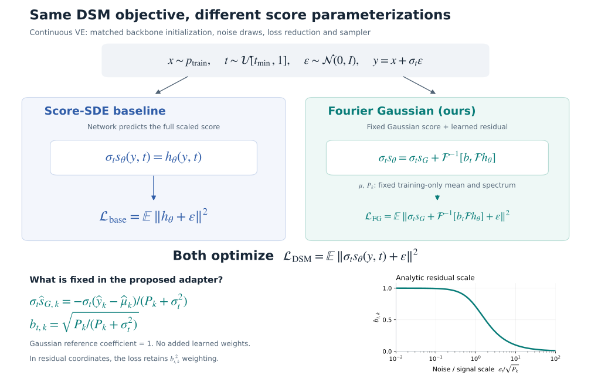

# Fourier Score

**Gaussian reference scores and frequency-normalized neural residuals for image generation.**

This repository studies whether a fixed Gaussian reference, estimated from the
training distribution, improves the learning efficiency of score-based generative
models. The backbone learns a residual around that reference; a fixed Fourier
operator scales the residual at each noise level. Experiments hold the backbone,
initialization, corruption process, DSM objective and sampler constant across arms.

Two experimental settings are implemented: **pixel-space NCSN++ / continuous VE**
and **latent diffusion with a frozen pretrained KL/VQ first stage**. Denoisers in
the controlled comparisons are trained from scratch. Public pretrained models
are available as separate inference references.

[Method](#method) · [Run experiments](#run-experiments) ·
[Pretrained references](#official-pretrained-references) ·
[Evaluation](#sampling-and-evaluation) · [Implementation](#implementation-and-status)



*The diagram shows the continuous VE, sigma-squared-weighted DSM setting used
here, suppressing the common pixel-reduction constant. The curve is the analytic
residual scale, not a measured learning curve.
[PNG](docs/assets/loss_comparison.png) · [Figure source](scripts/plot_method.py)*

## Method

For $y=x+\sigma_t\epsilon$, with $\epsilon\sim\mathcal{N}(0,I)$, the shared objective is

$$
\mathcal{L}_{\mathrm{DSM}}=\mathbb{E}_{x,t,\epsilon}
\left\|\sigma_t s_\theta(y,t)+\epsilon\right\|^2.
$$

The **Score-SDE baseline** predicts the scaled score directly:
$\sigma_t s_\theta=h_\theta$. The **Fourier Gaussian parameterization** uses

$$
\sigma_t s_\theta=\sigma_t s_G+
\mathcal{F}^{-1}\!\left[b_t\,\mathcal{F}h_\theta\right],\qquad
\widehat{s}_{G,k}=-\frac{\widehat{y}_k-\widehat{\mu}_k}{P_k+\sigma_t^2},\qquad
b_{t,k}=\sqrt{\frac{P_k}{P_k+\sigma_t^2}}.
$$

Here $\mu$ is the full mean image and $P_k$ is the per-channel Fourier power,
estimated from **training data only**. The FFT is orthonormal; power is floored for
stability. The Gaussian reference has coefficient one. No learned layer or
parameter is added to NCSN++.

### How the losses differ

Expressed in the raw network output, the baseline minimizes
$\mathbb{E}\|h_\theta+\epsilon\|^2$, while ours minimizes
$\mathbb{E}\|\sigma_t s_G+\mathcal{F}^{-1}[b_t\mathcal{F}h_\theta]+\epsilon\|^2$.
They are two parameterizations of the **same DSM objective**; their gradients
with respect to the network output differ through the fixed spectral operator.

The motivation for $b_t$ comes from the Gaussian-subtracted target
$T=-\epsilon-\sigma_t s_G$. With matching second moments,
$\mathbb{E}|\widehat{T}_k|^2=b_{t,k}^2$; Gaussianity of the data is not required
for this identity. The raw residual target is therefore normalized by $b_t$.
Estimation and flooring make this normalization approximate in practice.
The implemented loss still retains **$b_{t,k}^2$ weighting** in normalized
residual coordinates. Dropping that weighting would change the objective.

The table defines the four primary experimental arms. They use the same initial
backbone weights; the interpreted initial scores differ because of the reference.

| `--parameterization` | Fixed reference | Residual scale | Experimental role |
|---|---|---|---|
| `score` | None | 1 | Score-SDE DSM baseline |
| `scalar_gaussian` | Channelwise scalar covariance; same full mean | Channelwise scalar | Gaussian reference without frequency-dependent covariance |
| `fourier_gaussian_unscaled` | Empirical Fourier covariance | 1 | Reference without residual normalization |
| `fourier_gaussian` | Empirical Fourier covariance | $b_{t,k}$ | Full proposed parameterization |

`diffusion` is an additional noise-prediction sign convention. For the same
forward process it is algebraically equivalent to score prediction after a sign
change; selecting a DDPM process is a separate experiment. The latent path uses
a common epsilon-output adapter and replaces $P_k$ by $\alpha_t^2P_k$ and $\mu$
by $\alpha_t\mu$ in the Gaussian formulas.

See [the derivation and assumptions](docs/MATH.md) and
[ablation interpretation](docs/ABLATIONS.md). This is an output-parameterization
study, related to Gaussian/EDM preconditioning; the algebra alone does not establish
faster convergence or better FID.

## Run experiments

Run commands from the repository root. Python 3.11 and `uv.lock` define the environment.

```bash
uv sync --locked --python 3.11 --extra ldm --extra datasets --extra metrics
uv run --locked python scripts/doctor.py --device cuda
```

Pixel experiments need only `uv sync --locked --python 3.11`. Use `--device cpu`
or `--device mps` for supported local runs. Training is single-device FP32;
microbatch accumulation controls memory while preserving effective batch size.

### 1. Check the complete pipeline

```bash
# Three updates on synthetic data; no dataset or pretrained weights needed.
uv run --locked python train.py -c configs/smoke.json --device cpu \
  --set name=readme_smoke
uv run --locked python sample.py -r saved/readme_smoke/last.pt \
  -o saved/readme_smoke_samples
uv run --locked python evaluate.py dsm -r saved/readme_smoke/last.pt \
  -o saved/readme_smoke_dsm.json
```

Use a new run name/output directory when repeating a command; completed runs and
sample folders are not overwritten. This smoke run checks execution, not quality.

### 2. Prepare CIFAR-10 and the common statistics

```bash
uv run --locked python scripts/prepare.py \
  -c configs/cifar10_ablation.json --download
```

Images live under `data/`; training-only mean/power caches live under `data/stats/`.
The same cache and split are shared by every parameterization. MNIST also supports
automatic download via `configs/mnist.json` and `--download`.

| CIFAR-10 protocol | Optimizer updates | Training / diagnostic images | Run prefix |
|---|---:|---|---|
| [50K pilot](configs/cifar10_ablation.json) | 50,000 | 45,000 / 5,000 validation | `cifar10_50k_holdout5000` |
| [950K](configs/cifar10_950k.json) | 950,000 | 50,000 / CIFAR-10 test | `cifar10_950k_full` |
| [1.3M](configs/cifar10_1m3.json) | 1,300,000 | 50,000 / CIFAR-10 test | `cifar10_1m3_full` |

These presets use NCSN++ with `num_res_blocks=4` per resolution. The two full-data
protocols differ only in budget and name; the 950K preset does not select the
pretrained deep model with `num_res_blocks=8`. Use the pilot to select hyperparameters and
the test split for reporting.

### 3. Train the controlled comparison

```bash
# Inspect the four arms × three paired seeds before launching.
bash scripts/reproduce_cifar10.sh 50k --device cuda --seeds 42 43 44 \
  --set trainer.microbatch_size=32 --dry-run

# Run those experiments sequentially, preparing any missing data/cache once.
bash scripts/reproduce_cifar10.sh 50k --download --device cuda --seeds 42 43 44 \
  --set trainer.microbatch_size=32

# A single arm, or resume that arm after interruption.
uv run --locked python train.py -c configs/cifar10_ablation.json --download \
  --device cuda --parameterization fourier_gaussian --set trainer.microbatch_size=32
uv run --locked python train.py \
  -r saved/cifar10_50k_holdout5000_fourier_gaussian_s42/last.pt
```

The single-arm command is an alternative to the comparison runner, not an extra
run to append to the same output folder. Replace `50k` with `950k` or `1m3` for a
larger budget. Keep microbatch size, backend and precision identical across arms.
Resume requires the same source and locked runtime; use a separate worktree for
edits while training is running. [Detailed recipes and timing](docs/EXPERIMENTS.md)
explain how to measure a short run before allocating a full training budget.

### 4. Run a frozen-first-stage latent experiment

```bash
# Original weights + original dataset + official CompVis split lists.
uv run --locked --extra datasets python scripts/download_ldm.py \
  --model lsun_churches --with-data

# Frozen KL encode, posterior-aware latent cache, and training-only statistics.
uv run --locked --extra ldm python ldm.py prepare \
  -c configs/ldm/lsun_churches_l2.json --device cuda

# Inspect, then launch the three latent arms with paired seeds.
uv run --locked --extra ldm python ldm.py compare \
  -c configs/ldm/lsun_churches_l2.json --device cuda --seeds 42 43 44 --dry-run
uv run --locked --extra ldm python ldm.py compare \
  -c configs/ldm/lsun_churches_l2.json --device cuda --seeds 42 43 44
```

The VAE/VQ stage stays frozen and the latent denoiser starts from scratch. FFHQ,
CelebA-HQ, LSUN Churches and Bedrooms use the native CompVis architectures,
schedules and paper-derived batch/LR/update budgets. Churches' original preset
uses **L1**; the `_l2` preset explicitly applies the common **L2/DSM** loss to all
compared arms. Default latent arms are epsilon / scalar Gaussian / Fourier Gaussian.

Weights go to `pretrained/ldm/<model>/`; datasets use `data/ffhq`, `data/celebahq`
or `data/lsun/{churches,bedrooms}`; latent caches use `data/ldm_cache/<model>/`.
FFHQ/LSUN download directly. CelebA-HQ requires the original `.npy` directory/ZIP
or its URL. [The LDM guide](docs/LDM.md) covers data import, full native presets,
KL posterior sampling, VQ decode, latent evaluation, sampling and RGB FID.

## Sampling and evaluation

```bash
# All inference uses EMA. For a quick check, request 64 images in a new folder.
uv run --locked python sample.py \
  -r saved/cifar10_50k_holdout5000_fourier_gaussian_s42/last.pt \
  -o saved/cifar10_50k_fg_samples50k --device cuda \
  --num-samples 50000 --batch-size 64

uv run --locked python evaluate.py dsm \
  -r saved/cifar10_50k_holdout5000_fourier_gaussian_s42/last.pt \
  -o saved/cifar10_50k_fg_dsm.json --device cuda

uv run --locked python scripts/export_real.py -c configs/cifar10_ablation.json \
  --split train -o saved/cifar10_pilot_real
uv run --locked --extra metrics python evaluate.py fid \
  --real saved/cifar10_pilot_real/png --generated saved/cifar10_50k_fg_samples50k/png \
  --device cuda -o saved/cifar10_50k_fg_fid.json
```

Use the same real split, sample count, sampler, NFE, batch size and metric backend
for every arm. Pixel-space FID/IS uses `torch-fidelity`; this is a new evaluation
protocol relative to the original Score-SDE TensorFlow metrics. LDM's `fid`
command computes FID only. The CIFAR pilot's 45K-image reference differs from the
full-data protocol's 50K training reference; do not mix their FID curves.

| Artifact | Contents |
|---|---|
| `saved/<run>/config.json`, `environment.json` | Resolved protocol, source/runtime fingerprint |
| `architecture.json` | Backbone structure and initial weight fingerprint |
| `metrics.jsonl` | Training loss, held-out DSM, timing and optional frequency diagnostics |
| `last.pt`, `ema_*.pt` | Exact training resume / EMA inference snapshots |
| Sample output directory | PNGs, NHWC uint8 NPZ shards, preview and `settings.json` |

For the learning-efficiency question, report DSM and FID against **both optimizer
updates and elapsed training time**, plus throughput, cache preparation cost,
sample NFE and variation across independent seeds. Aggregate learning curves are
currently assembled from the saved artifacts; no automatic report sweep is implied.

## Official pretrained references

The downloaders fetch missing files, retain source URLs/hashes, and verify completed
downloads on reuse. Weights and datasets are ignored by Git.

| Score-SDE reference | Original file | Local bundle |
|---|---|---|
| CIFAR-10 NCSN++ continuous VE | `checkpoint_24.pth` | `pretrained/score_sde/cifar10_ncsnpp_continuous/` |
| CIFAR-10 NCSN++ deep continuous VE | `checkpoint_12.pth` | `pretrained/score_sde/cifar10_ncsnpp_deep_continuous/` |
| FFHQ-256 NCSN++ continuous VE | `checkpoint_48.pth` | `pretrained/score_sde/ffhq_256_ncsnpp_continuous/` |

```bash
python scripts/download_score_sde.py --list
python scripts/download_score_sde.py --all --dry-run
uv run --locked --extra datasets python scripts/download_score_sde.py --all

# Strictly map original model/EMA tensors to a local inference-only snapshot.
uv run --locked python scripts/import_score_sde.py --model cifar10_ncsnpp_continuous
uv run --locked python sample.py \
  -r pretrained/score_sde/cifar10_ncsnpp_continuous/ema.pt \
  -o saved/official_cifar10_reference --device cuda --num-samples 64 --batch-size 64

# CompVis LDM public denoiser reference, with native sampling and frozen decode.
uv run --locked --extra ldm python ldm.py sample \
  -c configs/ldm/lsun_churches.json --pretrained --weights ema --device cuda \
  --num-samples 64 --batch-size 1 -o saved/official_churches_reference
```

These references have their own training histories and are **not** paired arms of
the from-scratch learning-efficiency experiment. Score-SDE exports use the local
sampler and preserve their official-source identity in output metadata. Original
`.pth` files are not local training-resume checkpoints. See
[Score-SDE download/import details](docs/SCORE_SDE.md) for scope and verification.

## Implementation and status

| Component | Entry points |
|---|---|
| Gaussian reference / residual normalization | [method.py](fourier_score/method.py), [statistics.py](fourier_score/statistics.py) |
| Shared score adapter and DSM | [model.py](fourier_score/model.py), [loss.py](fourier_score/loss.py) |
| Pixel training / inference / metrics | [train.py](train.py), [sample.py](sample.py), [evaluate.py](evaluate.py) |
| Native latent experiment pipeline | [ldm.py](ldm.py), [fourier_score/ldm/](fourier_score/ldm/) |
| LDM throughput / full-budget ETA | [benchmark runner](scripts/benchmark_ldm.py), [16 measured dataset/arm runs](verification/2026-09-21-ldm-timing/README.md) |
| Reproducibility checks | [tests/](tests/), [verification records](verification/README.md) |

The repository includes numerical, checkpoint-resume and end-to-end execution
checks. **A completed multi-seed learning-efficiency or FID result is not yet
reported.** Implementation checks and pretrained samples do not establish a
quality improvement for the proposed method.

```bash
uv run --locked --extra ldm --extra metrics --extra datasets python -m pytest -q
# Regenerate the committed method figure; not needed for training.
uv run --locked --extra figures python scripts/plot_method.py
```

Further documentation: [installation](docs/INSTALL.md), [configuration](docs/CONFIG.md),
[development and resume](docs/DEVELOPMENT.md), [MPS](docs/MPS.md),
[한국어 사용 안내](docs/USAGE.md), [source attribution](docs/PROVENANCE.md).

## References

- Song et al., [Score-Based Generative Modeling through Stochastic Differential Equations](https://arxiv.org/abs/2011.13456), ICLR 2021. [Official PyTorch code](https://github.com/yang-song/score_sde_pytorch).
- Rombach et al., [High-Resolution Image Synthesis with Latent Diffusion Models](https://arxiv.org/abs/2112.10752), CVPR 2022. [Official code](https://github.com/CompVis/latent-diffusion).
- Karras et al., [Elucidating the Design Space of Diffusion-Based Generative Models](https://arxiv.org/abs/2206.00364), NeurIPS 2022.

See [LICENSE](LICENSE) and [NOTICE](NOTICE) for code attribution. Downloaded
third-party weights and datasets remain subject to their respective terms.
