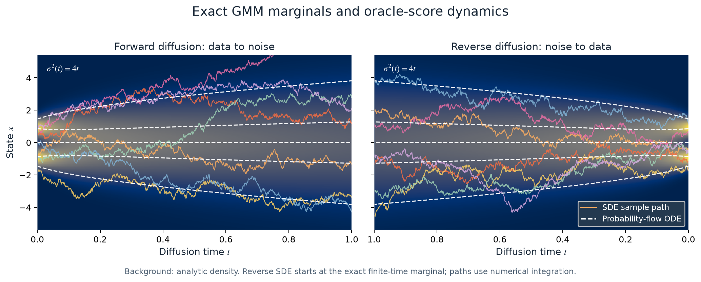
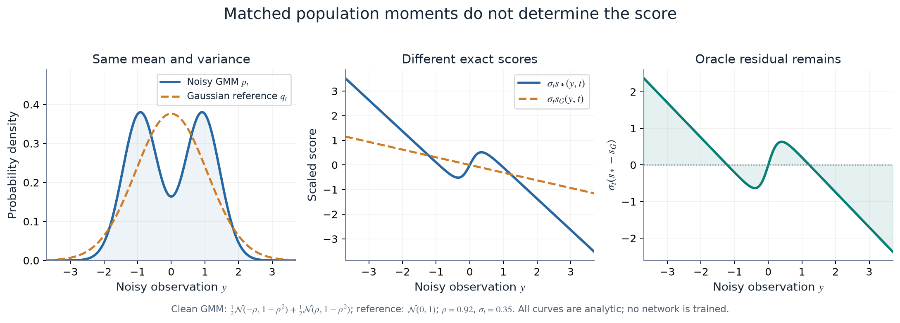
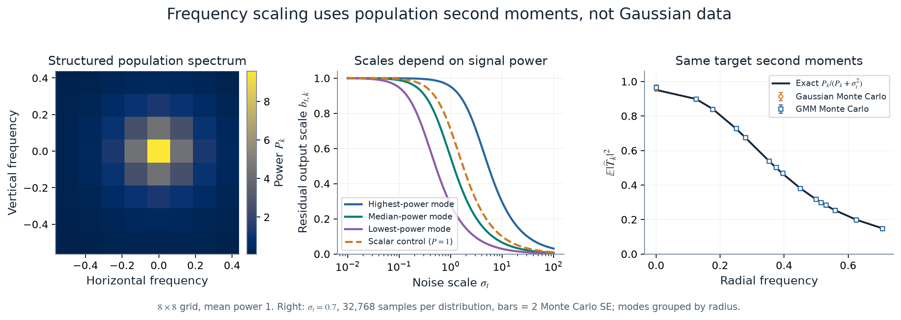

# Reproducible scientific figures

The checked-in figures explain the parameterization and synthetic oracle. They
are original plots generated by this repository, with no training or external
image download. **They do not establish a CIFAR-10 or Churches improvement.**
The GMM notebook separately produces figures from measured training runs.

## Generate the explanatory figures

From the repository root:

```bash
uv sync --locked --extra figures
uv run --locked --extra figures python scripts/plot_method.py
uv run --locked --extra figures python scripts/plot_diagnostics.py
```

Both scripts run on the CPU, with no PyTorch or GPU dependency in the figure
code itself. The diagnostic script accepts `--out PATH`, `--seed INT`, and
`--samples INT` (at least 8,192). The default seed is `20260922`; the default
moment diagnostic uses 32,768 observations per distribution.

Each figure has a PNG for GitHub, an SVG for editing, and a PDF for a paper.
PDF text uses embedded TrueType fonts. Curves and text are vector; the density
and frequency-power heatmaps use embedded raster images. Fixed seeds, SVG IDs, and omitted creation timestamps
make reruns stable within the same dependency versions. Different NumPy or
Matplotlib versions can change numerical streams or rendering.

| Figure | Purpose | Source |
| --- | --- | --- |
| [Method diagram](assets/loss_comparison.png) | Shared DSM objective, fixed Gaussian score, and scaled neural residual | [`plot_method.py`](../scripts/plot_method.py) |
| [Stochastic process](assets/stochastic_process.png) | Forward and reverse paths against exact evolving GMM densities | [`plot_diagnostics.py`](../scripts/plot_diagnostics.py) |
| [Gaussian and residual](assets/gaussian_residual.png) | Same population moments do not imply the same score | [`plot_diagnostics.py`](../scripts/plot_diagnostics.py) |
| [Frequency scaling](assets/frequency_scaling.png) | Per-frequency output scales and regression-target second moments | [`plot_diagnostics.py`](../scripts/plot_diagnostics.py) |

[`diagnostics.json`](assets/diagnostics.json) records the source hash, package
versions, seeds, settings, and numerical checks. The corresponding plot arrays
are in `docs/assets/diagnostics_data.npz`; load them with
`numpy.load(path, allow_pickle=False)`. These are synthetic data, not benchmark
results or model checkpoints.

## What the figures mean

### Forward and reverse stochastic processes



This one-dimensional educational example uses

$$
p_0(x)=\frac12\mathcal N(-\rho,1-\rho^2)
      +\frac12\mathcal N(\rho,1-\rho^2),\qquad \rho=0.92.
$$

The mean is zero and the variance is one. For the illustrative VE process
$\sigma_t^2=4t$, $0\le t\le1$, the forward SDE is $dX_t=2\,dW_t$.
Each mixture component has noisy variance $1-\rho^2+4t$, so the plotted density
is exact. The probability-flow ODE is

$$
\frac{dX_t}{dt}=-2s_*(X_t,t),
$$

and the reverse SDE is

$$
dX_t=-4s_*(X_t,t)\,dt+2\,d\bar W_t,\qquad dt<0.
$$

The reverse plot runs from $t=1$ at the left to $t=0$ at the right. It starts
from the **exact noisy mixture** $p_1$, not a Gaussian approximation to that
finite-time distribution. SDE paths use Euler–Maruyama and ODE paths use Heun,
both with 1,000 steps. White ODE curves are the same deterministic trajectories
viewed in opposite time directions. Their initial positions are chosen for
visibility; they are not independent data samples. The seven forward SDE paths
use a fixed spread of component labels and independent Gaussian draws within
those components. The colored curves are illustrative realizations, not a
finite-sample goodness-of-fit test.

The schedule and dimension here are chosen for a readable illustration. They
are different from the 8×8 GMM training notebook and the image-training recipes.
For background on SDE and probability-flow sampling, see the
[Score-SDE reference implementation](https://github.com/yang-song/score_sde_pytorch).

### Matched moments, different scores



The same clean GMM has the same mean and variance as $q_0=\mathcal N(0,1)$.
After adding Gaussian noise with $\sigma=0.35$, both noisy distributions still
have identical first and second moments, but their densities and scores differ.
For mixture responsibilities $\gamma_j(y,t)$, the exact GMM score is

$$
s_*(y,t)=-\sum_j\gamma_j(y,t)C_{j,t}^{-1}(y-\alpha_t\mu_j),
\qquad C_{j,t}=\alpha_t^2\Sigma_j+\sigma_t^2I.
$$

The right panel plots the **oracle** quantity $\sigma_t(s_*-s_G)$. It shows what
is left for a residual model to learn, but it does not demonstrate that a
trained network has learned it. That claim requires the notebook's held-out
true-score error from completed experiments, including the Gaussian control.
Matching a full covariance is exact for this synthetic construction. An
image's diagonal Fourier power does not in general specify its full covariance.

### Frequency-dependent residual scales



An 8×8 real field uses an orthonormal FFT $F$ and positive, conjugate-symmetric
power $P_k$, normalized so its mean is one. The structured spectrum is
$(1+(\|k\|/0.15)^2)^{-1.5}$ before normalization. The Gaussian and non-Gaussian
mixture have the same **full population covariance**

$$
C=F^{-1}\operatorname{diag}(P)F.
$$

The mixture construction uses a fixed orthogonal basis $q_j$, symmetric means
$\pm\rho\sqrt d\,C^{1/2}q_j$, equal component weights $1/(2d)$, and common
within-component covariance $(1-\rho^2)C$, with $\rho=0.85$. Thus the total mean
is zero and covariance is $C$ by construction, without estimating statistics.

For $y=\alpha_t x+\sigma_t\epsilon$ and the Gaussian reference score $s_G$, let

$$
T=-\epsilon-\sigma_t s_G(y,t),\qquad
V_{t,k}=\alpha_t^2P_k,\qquad
b_{t,k}^2=\frac{V_{t,k}}{V_{t,k}+\sigma_t^2}.
$$

When the reference uses the population mean and per-frequency second moments,

$$
\mathbb E|\widehat T_k|^2=b_{t,k}^2.
$$

This identity does not require Gaussian data. It describes the noisy
**regression target**, not the variance of the optimal conditional residual
$\sigma_t(s_*-s_G)$ or of a trained network's output. The right panel checks
the identity at $\alpha=1,\sigma=0.7$ by Monte Carlo. Equal-radius modes are
averaged within each sample before computing standard errors, respecting their
within-sample dependence. Error bars are two Monte Carlo standard errors, not
variation across training seeds. The curves need not separate for the two
distributions; their population target moments are equal.

The scalar control replaces $P_k$ by its spatial mean. For a flat spectrum
($\lambda=0$ in the notebook), scalar and Fourier scores and scales coincide.
The figure script checks equality of these operators numerically. With real
images, estimated or floored spectra give a plug-in scaling rule; the exact
population identity need not hold for that finite-sample reference.

## Figures from completed training

Run [`gmm_fourier_residual.ipynb`](../notebooks/gmm_fourier_residual.ipynb) to
generate measured true-score learning curves, noise-resolved and
frequency-resolved errors, spectrum-sweep results, and comparisons against the
Gaussian reference. Keep the notebook's resolved configuration, metric CSVs,
seed-level results, checkpoints, and run manifest alongside those figures.
Its smoke preset checks execution; it does not establish convergence or a
publication result.

For CIFAR-10 and Churches, publish plots only after the selected checkpoints
and evaluation protocol have been fixed and all intended seeds are available.
Useful main-paper candidates are the method diagram, the matched-moment GMM
mechanism test with held-out true-score error, and scalar/Fourier comparisons
at matched training budgets. Use seed-level measurements for uncertainty;
label partial runs and externally quoted baseline numbers explicitly. The
analytic figures here are supporting explanations, not substitutes for those
experiments.

## Numerical checks performed by the script

- The analytic GMM score agrees with the finite-difference log-density gradient.
- The 8×8 mixture has zero mean and the specified full covariance.
- A flat spectrum makes scalar and Fourier reference scores and scales equal.
- Gaussian and GMM Monte Carlo target moments agree with the analytic values
  within the stated finite-sample tolerance.

The default checks fail loudly if an implementation change violates one of
these conditions. The numerical SDE trajectories themselves are illustrative
discretizations; no exact finite-step sampling claim is made.
