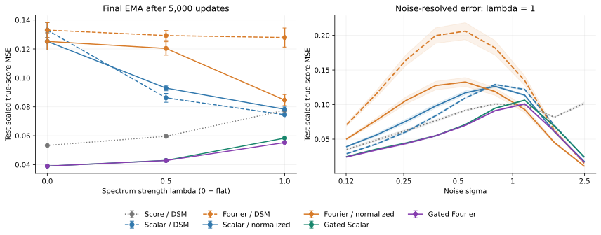

# GMM gated comparison

[Back to README](../../README.md#gmm-gated-comparison) · [All reports](../README.md) · Provenance: [epoch 0](../provenance.md)

The noise-gated adapter improves the overall error in all three spectra in this
5,000-update experiment. At $\lambda=1$, **Gated Fourier reduces test error by
25.8% versus the best existing baseline (Scalar/DSM), 34.7% versus Fourier
normalized residual, and 5.2% versus Gated Scalar**. Each of these paired
comparisons improves in all three training seeds.

The same MLP, Adam settings, online training streams and final EMA budget as the
[previous comparison](loss-comparison.md) are used. All 45 existing baseline
runs reproduce their archived final EMA weights **exactly**. The following
numbers use a **new test bank**, so baseline errors differ slightly from the
previous table. The metric is noise-scaled true-score MSE; values are mean ±
sample standard deviation across seeds 42, 43 and 44.

| Parameterization / objective | $\lambda=0$ | $\lambda=0.5$ | $\lambda=1$ |
|---|---:|---:|---:|
| Score / DSM | 0.05328 ± 0.00020 | 0.05961 ± 0.00059 | 0.07764 ± 0.00121 |
| Scalar / DSM | 0.13302 ± 0.00511 | 0.08625 ± 0.00306 | 0.07455 ± 0.00077 |
| Fourier / DSM | 0.13302 ± 0.00511 | 0.12927 ± 0.00347 | 0.12789 ± 0.00659 |
| Scalar / normalized residual | 0.12523 ± 0.00593 | 0.09297 ± 0.00184 | 0.07834 ± 0.00159 |
| Fourier / normalized residual | 0.12523 ± 0.00593 | 0.12037 ± 0.00465 | 0.08466 ± 0.00380 |
| Gated Scalar / normalized residual | **0.03904 ± 0.00009** | 0.04295 ± 0.00040 | 0.05834 ± 0.00069 |
| Gated Fourier / normalized residual | **0.03904 ± 0.00009** | **0.04286 ± 0.00037** | **0.05530 ± 0.00072** |

One common switch was selected on validation across both covariances, all three
spectra and all three seeds. With sharpness $p=4$, the mean validation errors
for $\sigma_c=0.5,1.0,1.5$ were **0.08400, 0.05041, 0.04617**, respectively.
The selected **$\sigma_c=1.5$** is the best of these three candidates. It is
shared by Gated Scalar and Gated Fourier for every spectrum and seed.
Selection used final-step validation only; the test bank was constructed after
recording the choice. There were 99 training runs and 63 final test evaluations,
with 18,432 independent test observations per spectrum, shared across all
methods and training seeds. No selected run activated gradient clipping.

**The high-noise tradeoff remains.** At $\lambda=1$, grouping the nine log-noise
bins into low ($\sigma<0.3$), middle ($0.3\leq\sigma<1$), and high
($\sigma\geq1$) regions gives:

| Noise region | Fourier normalized residual | Gated Fourier | Relative change |
|---|---:|---:|---:|
| Low | 0.07787 | 0.03413 | −56.2% |
| Middle | 0.12633 | 0.07203 | −43.0% |
| High | 0.04979 | 0.05974 | +20.0% |

Thus the gate substantially improves low/middle noise, but does not fully retain
the ungated normalized model's high-noise accuracy. At $\lambda=0$ the two gated
covariances agree numerically; at $\lambda=0.5$ their difference is small.
These conclusions concern one fixed GMM geometry and 5,000 updates; the experiment
does not establish long-run or image-generation performance.



*Mean ± one training-seed standard deviation. [PNG](../../assets/gmm_gated_comparison/gmm_gated_comparison.png) ·
[PDF](../../assets/gmm_gated_comparison/gmm_gated_comparison.pdf).*

Reproduce with:

```bash
uv run --locked --extra figures python scripts/run_gmm_comparison.py \
  --output saved/gmm_gated_reproduction --workers 12
```

Archived [summary and protocol](../../assets/gmm_gated_comparison/summary.json) ·
[per-seed results](../../assets/gmm_gated_comparison/per_seed.csv) ·
[paired comparisons](../../assets/gmm_gated_comparison/paired_comparisons.csv) ·
[validation selection](../../assets/gmm_gated_comparison/validation_selection.csv) ·
[validation curves](../../assets/gmm_gated_comparison/validation_curves.csv) ·
[noise levels](../../assets/gmm_gated_comparison/noise_resolved.csv) ·
[frequency bands](../../assets/gmm_gated_comparison/frequency_resolved.csv).
[Verification](../../assets/gmm_gated_comparison/verification.json) records passing tests,
notebook execution, CPU diagnostics and unchanged numerical source hashes.
[Baseline reproduction](../../assets/gmm_gated_comparison/baseline_reproduction.json)
checks all 45 archived final EMA hashes. An independent
[dense log-density autograd check](../../assets/gmm_gated_comparison/oracle_validation.json)
agrees with the 64-dimensional oracle within $2.7\times10^{-14}$ maximum absolute
score error. [Execution history](../../assets/gmm_gated_comparison/execution_history.json)
records the launcher used after increasing CPU concurrency to 12 workers.
