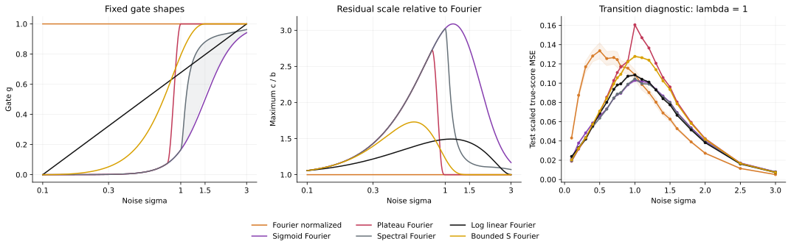

# GMM log-axis gates

[Back to README](../../README.md#gmm-log-axis-gates) · [All reports](../README.md) · Provenance: [epoch 0](../provenance.md)

This experiment evaluates the two shapes in the
[log-axis design](../method/gates.md#log-axis-gate-design), with all settings fixed before
training. **Log linear** rises from $g=0$ at $\sigma=0.1$ to $g=1$ at $3$,
linearly in $\log\sigma$. **Bounded S** uses bounds $[0.1,1.5]$, center
$\sigma_c=0.75$ and exponent $\kappa=2$, so it reaches $g=0.5$ at $0.75$ and
joins the exact $g=1$ plateau at $1.5$ with zero slope. Sigmoid and tanh are
equivalent expressions for this one S curve; no duplicate tanh arm is trained.

Both new gates use **one backbone and one normalized residual MSE**, with no
teachers, auxiliary objectives or pretrained initializations. Their Scalar
counterparts are included as controls for frequency-dependent covariance.
The protocol records the SHA-256 of the previously plotted design and checks
that both new Fourier configurations match it exactly.

The **36 new runs** use three spectra ($\lambda=0,0.5,1$), seeds 42–44 and
5,000 updates each, with 16 concurrent single-threaded CPU jobs. The backbone
has 102,016 parameters; initialization, online sample/noise stream, optimizer,
EMA and training budget match the earlier experiments. The **135 existing
controls** are reused only after matching configurations, initialization and
EMA hashes, statistics and every final validation noise bin. These include
the earlier sigma-coordinate Linear/Tanh models, whose names remain distinct
from the new log-axis gates.

All **171 models** are evaluated on a new shared test bank per spectrum,
`gmm-log-gates-v1`: 2,048 observations at each of nine log-noise midpoint bins.
Earlier methods' numbers therefore differ slightly from their previous tables.
The metric is noise-scaled true-score MSE, mean ± one sample standard deviation
over three training seeds; lower is better. A separate $\lambda=1$ diagnostic
uses 21 noise levels from $0.1$ to $3$ with 1,024 observations each. It includes
the new gates' centers and endpoints and does not enter the primary mean.

**Neither new schedule improves consistently on the original sigmoid.** At
$\lambda=1$, Log linear gives $0.05501\pm0.00048$, just **0.36% lower** than
Sigmoid Fourier, with lower error in two of three paired seeds. Bounded S
gives $0.05995\pm0.00063$, **8.6% higher** in the mean and worse in all three
seeds. Spectral Fourier retains the lowest overall mean, $0.05306\pm0.00055$;
Log linear and Bounded S are respectively 3.7% and 13.0% worse than it.
Three seeds do not establish a meaningful advantage for the small Log linear
difference against the sigmoid.

| Method | $\lambda=0$ | $\lambda=0.5$ | $\lambda=1$ |
|---|---:|---:|---:|
| Score / DSM | 0.05381 ± 0.00009 | 0.05918 ± 0.00061 | 0.07738 ± 0.00124 |
| Scalar / DSM | 0.13366 ± 0.00511 | 0.08642 ± 0.00332 | 0.07455 ± 0.00081 |
| Fourier / DSM | 0.13366 ± 0.00511 | 0.12929 ± 0.00286 | 0.12778 ± 0.00687 |
| Scalar / normalized | 0.12576 ± 0.00599 | 0.09322 ± 0.00192 | 0.07834 ± 0.00167 |
| Fourier / normalized | 0.12576 ± 0.00599 | 0.12031 ± 0.00459 | 0.08464 ± 0.00400 |
| Sigmoid Scalar | 0.03949 ± 0.00010 | 0.04272 ± 0.00043 | 0.05822 ± 0.00060 |
| Sigmoid Fourier | 0.03949 ± 0.00010 | 0.04263 ± 0.00041 | 0.05521 ± 0.00068 |
| Plateau Scalar | 0.06162 ± 0.00062 | 0.05644 ± 0.00089 | 0.06889 ± 0.00149 |
| Plateau Fourier | 0.06162 ± 0.00062 | 0.05986 ± 0.00056 | 0.06221 ± 0.00022 |
| Spectral Scalar | 0.04093 ± 0.00006 | 0.04322 ± 0.00034 | 0.05765 ± 0.00078 |
| Spectral Fourier | 0.04093 ± 0.00006 | 0.04369 ± 0.00041 | 0.05306 ± 0.00055 |
| Previous sigma-linear Scalar | 0.04063 ± 0.00038 | 0.04298 ± 0.00028 | 0.05765 ± 0.00065 |
| Previous sigma-linear Fourier | 0.04063 ± 0.00038 | 0.04297 ± 0.00056 | 0.05402 ± 0.00060 |
| Previous sigma-tanh Scalar | 0.04003 ± 0.00002 | 0.04266 ± 0.00019 | 0.05792 ± 0.00062 |
| Previous sigma-tanh Fourier | 0.04003 ± 0.00002 | 0.04273 ± 0.00046 | 0.05391 ± 0.00056 |
| New Log linear Scalar | 0.05483 ± 0.00161 | 0.04927 ± 0.00054 | 0.05944 ± 0.00117 |
| New Log linear Fourier | 0.05483 ± 0.00161 | 0.05179 ± 0.00066 | 0.05501 ± 0.00048 |
| New Bounded S Scalar | 0.06796 ± 0.00229 | 0.05596 ± 0.00051 | 0.06610 ± 0.00156 |
| New Bounded S Fourier | 0.06796 ± 0.00229 | 0.06231 ± 0.00074 | 0.05995 ± 0.00063 |

At $\lambda=0$ and $0.5$, Log linear Fourier is **38.9% and 21.5% worse**
than Sigmoid Fourier; Bounded S Fourier is **72.1% and 46.2% worse**. Both
lose to the sigmoid in every paired seed at these spectra. At $\lambda=1$,
both still outperform Score / DSM, by 28.9% and 22.5%, respectively.

Noise-region means at $\lambda=1$ (the CSV also includes standard deviations):

| Method | Low: $\sigma<0.3$ | Middle: $0.3\leq\sigma<1$ | High: $\sigma\geq1$ |
|---|---:|---:|---:|
| Score / DSM | 0.04901 | 0.08879 | 0.09433 |
| Fourier / normalized | 0.07854 | 0.12529 | 0.05010 |
| Sigmoid Fourier | 0.03439 | 0.07112 | 0.06011 |
| Plateau Fourier | 0.02901 | 0.08207 | 0.07556 |
| Spectral Fourier | 0.03062 | 0.06971 | 0.05885 |
| Previous sigma-linear Fourier | 0.03151 | 0.06950 | 0.06106 |
| Previous sigma-tanh Fourier | 0.03200 | 0.06993 | 0.05982 |
| New Log linear Fourier | 0.03132 | 0.07455 | 0.05916 |
| New Bounded S Fourier | 0.02974 | 0.08005 | 0.07007 |

Relative to Sigmoid Fourier, Log linear reduces low/high error by **8.9% / 1.6%**
but raises middle error by **4.8%**. Bounded S reduces low error by **13.5%**,
bringing it within 2.5% of Plateau Fourier, but raises middle/high error by
**12.6% / 16.6%**. Each of these regional directions holds in all three paired
seeds. The separate transition diagnostic shows the Bounded S error increase
across much of the middle-to-high transition, despite its smooth gate.

Setting $g=1$ above $\sigma=1.5$ makes the Bounded S adapter and loss target
equal to those of Fourier / normalized there. It does **not** make the learned
backbone equal: the same weights also train on the different low/middle-noise
targets. The observed high-noise mean remains 39.9% above Fourier / normalized
(18.1% above for Log linear). These comparisons evaluate the fixed schedules
as a whole; their centers, widths and plateau locations also differ, so the
results do not isolate curve shape alone. No gradient clipping was activated
in the new runs.




Reproduce all 171 training runs from scratch:

```bash
uv run --locked --extra figures python scripts/run_gmm_log_gates.py \
  --output saved/gmm_log_gates_reproduction --workers 16
```

To train only the 36 new models using existing comparison checkpoints, add:

```bash
--reuse-baselines saved/gmm_gated_20260924 saved/gmm_plateau_20260924 saved/gmm_spectral_20260924 saved/gmm_gate_shapes_20260924
```

Use `--preset smoke --seeds 42` for a short pipeline check. Changes to bounds,
center or exponent require a new output directory. Future parameter selection
should use validation and a fresh test-bank version for the final comparison.
These results are limited to this GMM geometry and training budget; they do
not measure generated sample/image quality.

Archived [protocol](../../assets/gmm_log_gate_comparison/protocol.json) ·
[summary](../../assets/gmm_log_gate_comparison/summary.json) ·
[paired comparisons](../../assets/gmm_log_gate_comparison/paired_comparisons.csv) ·
[per-seed results](../../assets/gmm_log_gate_comparison/per_seed.csv) ·
[noise regions](../../assets/gmm_log_gate_comparison/noise_regions.csv) ·
[transition diagnostics](../../assets/gmm_log_gate_comparison/transition_resolved.csv) ·
[gate and scale curves](../../assets/gmm_log_gate_comparison/gate_profile.csv) ·
[checkpoint audit](../../assets/gmm_log_gate_comparison/checkpoint_audit.json) ·
[verification](../../assets/gmm_log_gate_comparison/verification.json).
Figures: [comparison PNG](../../assets/gmm_log_gate_comparison/gmm_log_gate_comparison.png) /
[PDF](../../assets/gmm_log_gate_comparison/gmm_log_gate_comparison.pdf),
[diagnostic PNG](../../assets/gmm_log_gate_comparison/gmm_log_gate_diagnostics.png) /
[PDF](../../assets/gmm_log_gate_comparison/gmm_log_gate_diagnostics.pdf).
