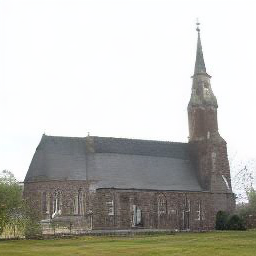

# Frozen-first-stage LDM verification — 2026-09-21

See [summary.json](summary.json) for the tested source hash, native configuration
hashes, exact architecture counts, commands and limits. This is a working-tree
verification, not a claim of reproduced paper FID or learning efficiency.

* Full suite: **197 passed, 2 skipped** (MPS unavailable).
* The pinned computational source files match their upstream bytes after reversing
  package-import edits. All four bundled training YAMLs are hash-checked.
* Tiny native KL and VQ models exercise strict frozen checkpoint loading, pixel
  flips encoded separately, posterior resampling, analytic training-only power,
  all four output conventions, identical U-Net initialization and exact CPU resume.
* [Original-source parity](upstream_parity.json) compares native `autoencoder.py`
  and `ddim.py` with the local implementation. KL/VQ encode/decode and epsilon /
  Fourier DDIM with eta 0 and 1 had zero maximum absolute error in this audit.
  Lightning is replaced only by `nn.Module`; original computational layers are
  the import-only vendored modules. Stochastic noise draws are explicitly paired.
* The real public Churches checkpoint loaded strictly with its original latent
  scale, **0.24578019976615906**. Public EMA sampling completed 200 native DDIM
  steps and decoded a 256×256 image, shown below.
* A newly initialized **294,966,916-parameter** Churches U-Net performed one CUDA
  Fourier-Gaussian/L2 optimizer update with its pretrained KL first stage frozen.
  The inputs were two synthetic RGB training images and two separate synthetic
  validation images. EMA evaluation, serialization, checkpoint loading, ten-step
  DDIM sampling and frozen decoding completed.
* Real reconstruction and torch-fidelity FID execution completed on two image
  pairs. The two-image covariance is singular; this is only an API execution
  check, and its numeric FID/PSNR is not a quality result.

The hardware/runtime is in [environment.json](environment.json): CUDA,
RTX 5060 Ti 16 GB, FP32. Reported smoke timing includes warmup and is not a
full-budget throughput benchmark. The final smoke checkpoint and images are
local ignored artifacts under `saved/ldm_native_churches_verified_fg/`.
The official weights remain under `pretrained/ldm/lsun_churches/`.

The parity check can be rerun with:

```bash
uv run --locked --extra ldm --extra metrics python scripts/verify_ldm_upstream.py \
  --output saved/ldm_upstream_parity.json
```

It downloads small, pinned and hash-verified source files; model weights are not
needed for that audit. Full-size public VQ weights, MPS execution, long training,
and final 50K-image FID were not tested in this session.

The image below is from the **public pretrained model**, not the one-update
experimental denoiser:


